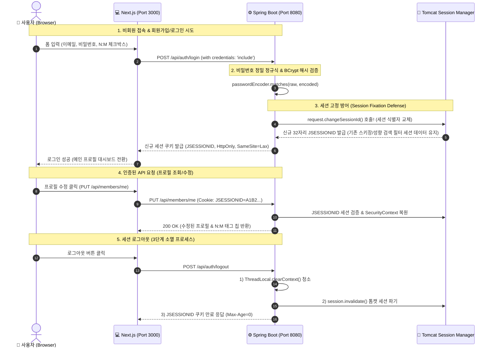

# 🏔️ Snowthing (눈팅)

> **전국 스키장 정보와 라이딩 경험을 나누고, 함께 탈 유저를 찾는 윈터스포츠 전용 커뮤니티 플랫폼**

---

##  1. 프로젝트 개요 (Overview)

* **서비스명**: Snowthing (눈팅)
* **목적**: 기존 노후화된 윈터스포츠 커뮤니티의 불편함(http 접속, 보안 취약, 이미지 첨부 오류 등)을 극복하고, 스노보더/스키어를 위한 커뮤니티 플랫폼을 제공합니다.
* **1차 MVP 핵심 타겟**:
  1. **숙련 이용자 (시즌 보더)**: 실시간 설질/현장 정보 공유, 프로필 N:M 중계(베이스 스키장/라이딩 성향) 등록
  2. **초보 이용자 (입문 보더)**: 부담 없는 비회원 익명 작성 및 정제된 Q&A 지식 탐색

---

##  2. 기술 스택 (Tech Stack)

### Frontend
* **Core**: Next.js 16 (App Router), TypeScript, React 19
* **State & Fetching**: React State, Fetch API (`credentials: 'include'`)
* **Styling**: Vanilla CSS, UI Component System

### Backend
* **Core**: Java 21 (LTS), Spring Boot 3.3.x, Spring Data JPA
* **Security & Auth**: Spring Security 6, Spring Session (Servlet Memory / Redis Ready), BCrypt
* **Build & Test**: Gradle, JUnit5, Mockito, MockMvc

### Database & Cache
* **RDBMS**: H2 (In-Memory Dev), MySQL 8.0 (Production)
* **In-Memory Cache**: Spring Session Redis (Scale-out Ready)

---

## 3. 세션 기반 인증 & 주요 아키텍처 설계 고민과 해결 (Architecture & Auth Flow)

Snowthing은 사용자 경험(UX) 최우선과 데이터 무결성 및 보안성을 수호하기 위해 다음과 같은 핵심 아키텍처 설계를 선택하였습니다.



---

### 아키텍처 고민 및 기술적 의사결정

#### 1. 공통 엔티티와 JPA Auditing (`@EnableJpaAuditing`) 도입

`createdAt`, `updatedAt` 컬럼은 회원가입, 게시글, 댓글 등 시스템 전체 도메인에서 공통으로 사용됩니다. 기존에는 애플리케이션 레벨에서 직접 `set`을 호출하거나 DB 레벨의 `sysdate`를 이용하려 했으나 여러 트레이드오프가 존재했습니다.

1. **애플리케이션 수동 주입 방식**: 엔티티마다 시간 생성 코드가 중복되고, 개발자의 실수로 `null`이 들어갈 위험이 있습니다.
2. **DB 레벨 `sysdate` 주입 방식**: JPA 1차 캐시 메모리에 올라간 엔티티 객체는 두 필드를 `null`로 가지고 있어, 회원가입 직후 응답 DTO를 반환할 때 시간이 `null`로 출력되는 **1차 캐시 메모리 ↔ DB 간 데이터 불일치**가 발생합니다.

- **해결 방안**: `BaseTimeEntity` 공통 추상 엔티티를 작성하고 JPA 영속성 라이프사이클 이벤트를 감시하는 `AuditingEntityListener`를 적용했습니다.  
  SQL 패킷이 DB로 넘어가기 바로 전 **자바 메모리 객체의 두 필드에 현재 시각을 먼저 채워 넣도록 처리**하여 코드 중복과 1차 캐시 데이터 불일치를 동시에 해결했습니다.

---

#### 2. 단일 세션 제한 ➔ 다중 디바이스 지원 및 30일 Remember-Me 슬라이딩 세션

초기에는 온라인 게임이나 은행 앱처럼 계정 도용 방지를 위해 하나의 세션만 허용하는 단일 세션을 구상했으나, 본 커뮤니티의 특성에 맞춰 **유저의 이탈률을 낮추고 장시간 체류하도록 만드는 것**이 서비스의 핵심 목표였습니다.

- **정책 비교 및 선택**:
  1. **단일 세션 + 짧은 만료시간 (초기안)**: 모바일/웹 동시 접속이 불가능하여 유저 경험(UX)이 저하되고 재로그인 스트레스가 증가함.
  2. **무제한 세션 (대안)**: 로그인 유저가 늘어날수록 서버 메모리(RAM)에 세션 객체가 누적되어 **OutOfMemory(OOM)로 인한 서버 다운** 위험 발생.
  3. **[선택] 다중 세션 지원 + 슬라이딩 세션 + Remember-Me (30일)**:
     - **기본 세션 1시간**: 활동 중인 유저는 세션 만료시간이 지속적으로 연장(Sliding Session)되어 끊김 없는 연속적인 경험 제공.
     - **Remember-Me (30일)**: 로그인 시 체크박스를 선택한 유저에게 30일 장기 세션을 부여하여 이용 편리성 확보.
     - **메모리 보호**: 30일 동안 활동이 전혀 없는 만료된 세션은 서블릿 컨테이너가 메모리에서 즉시 파기(Garbage Collection)하도록 구성하여 메모리 고갈 방지.

---

#### 3. 세션 고정 공격(Session Fixation Attack) 방어 메커니즘

로그인 성공 시 단순 기본 세션 발급만 수행하면, 로그인 전 해커가 유저 브라우저에 미리 심어둔 비회원 세션 ID가 로그인 시 유저의 권한 세션으로 그대로 승격되어 **공격자가 유저의 로그인 권한을 훔쳐내는 세션 탈취(Session Hijacking)** 위협에 무방비로 노출됩니다.

- **해결 방안**: 로그인 성공 직후 Spring Security의 `request.changeSessionId()`를 명시적으로 호출합니다.  
  기존 세션에 보관되어 있던 속성 데이터(장바구니 등)는 메모리 상에서 100% 보존하면서, 클라이언트 브라우저로 내려주는 **세션 식별자 키(`JSESSIONID`)만을 32자리 새 난수로 즉시 재발급**하여 공격자의 이전 세션 ID를 물리적으로 완전히 무효화시켰습니다.

---

## 4. 게시판(Post) 도메인 설계 & 기술적 의사결정 (Board Architecture & Decisions)

게시판은 Snowthing에서 가장 자주 읽히는 도메인이다. 그래서 단순 CRUD로만 만들지 않고, 목록 조회 비용, 익명 글 권한, 삭제 정책, 이미지 첨부 상태까지 같이 맞춰서 설계했다.

### 1) 게시글 도메인 구조

게시글의 중심 엔티티는 `Post`다. `Post` 하나가 제목, 본문, 작성 IP, 조회수, 댓글 수, 추천/비추천 수, 삭제 여부, 상태값을 가진다.

주변 엔티티는 역할을 나눠서 붙였다.

- `PostCategory`: 자유게시판, 익명 게시판, 장비 Q&A, 리조트 맛집 같은 게시판 종류를 담당한다.
- `PostImage`: 게시글 첨부 이미지를 1:N으로 저장한다. 이미지는 여러 장이 가능하고 `sortOrder`로 표시 순서를 가진다.
- `PostReaction`: 추천/비추천 이력을 저장한다. 로그인 사용자의 추천/비추천과 비로그인 사용자의 익명 추천/비추천을 둘 다 처리하기 위해 회원 ID 또는 `anonymous_voter_id` 쿠키 값을 기준으로 구분한다.
- `Comment`: 게시글 하위 댓글/대댓글을 담당한다.
- `Member`: 로그인 회원이 작성한 게시글의 작성자 정보다.

외부 API에서는 DB PK인 `post_id`를 그대로 노출하지 않고 `publicId`를 사용한다. 내부 PK는 조인과 인덱스에 쓰고, 외부 식별자는 URL과 API 응답에 쓰는 식으로 책임을 나눴다. 이렇게 해두면 사용자가 URL 숫자를 바꿔가며 내부 데이터 개수를 추측하는 문제도 줄일 수 있다.

### 2) 회원과 게시글의 연관관계

회원과 게시글은 `Member 1 : N Post` 관계다. 한 명의 회원은 여러 글을 쓸 수 있고, 하나의 회원 글은 한 명의 작성자를 가진다.

코드에서는 `Post.member`를 `@ManyToOne(fetch = FetchType.LAZY)`로 둔다. 게시글 목록을 볼 때마다 회원 엔티티 전체가 항상 필요한 것은 아니기 때문에 기본은 LAZY로 둔 것이다. 필요한 화면에서는 fetch join이나 DTO projection으로 필요한 작성자 정보만 가져온다.

다만 `member_id`는 nullable이다. 이유는 익명 게시판 때문이다.

- 로그인 회원 글: `member_id`가 있다.
- 로그인 회원이 익명으로 쓴 글: `member_id`를 남길 수 있고, 화면에서는 익명으로 마스킹한다.
- 비로그인 익명 글: `member_id`가 없다. 대신 작성 IP와 익명 비밀번호 해시로 수정/삭제 권한을 검증한다.

이 구조의 대가는 권한 검증이 조금 복잡해진다는 점이다. 그래서 수정/삭제 시 단순히 `member_id`만 보는 것이 아니라, 회원 글인지 익명 글인지 먼저 나눈 뒤 각각 다른 검증 로직을 탄다.

### 3) 게시글 상태와 유형

게시글 상태는 `PostStatus`로 관리한다.

- `NORMAL`: 정상 글이다. 목록과 상세 조회 대상이다.
- `DELETED`: 작성자 또는 관리자에 의해 삭제된 글이다. 현재는 Soft Delete 결과 상태로 사용한다.
- `BLOCKED`: 관리자가 부적절한 글을 차단한 상태다.
- `HIDDEN`: 비공개나 숨김 처리가 필요한 상태를 위해 분리해둔 값이다.
- `DRAFT`: 임시 저장을 고려한 상태값이다.

게시글 유형은 상태가 아니라 카테고리다. `PostCategory.code`로 구분한다.

- `FREE`: 자유게시판
- `ANONYMOUS`: 익명 게시판
- `QNA`: 장비 Q&A
- `FOOD`: 리조트 맛집

상태와 유형을 섞지 않은 이유는 역할이 다르기 때문이다. `NORMAL`, `DELETED`는 글의 현재 처리 상태이고, `FREE`, `ANONYMOUS`는 글이 속한 게시판이다. 이 둘을 같은 enum으로 합치면 “익명 게시판에 있는 삭제된 글” 같은 상태를 표현하기가 지저분해진다.

### 4) 목록/상세 응답을 분리한 이유

목록 응답과 상세 응답은 일부러 나눴다.

목록에서는 사용자가 글을 고르는 데 필요한 정보만 있으면 된다. 그래서 `PostListResponse`에는 `publicId`, `categoryName`, `title`, `writerNickname`, `thumbnailImageUrl`, `hasImage`, `viewCount`, `commentCount`, `likeCount`, `status`, `createdAt` 같은 목록용 필드만 둔다.

상세에서는 본문과 이미지 전체가 필요하다. 그래서 `PostDetailResponse`에는 `content`, `images`, `writer`, `isAnonymous` 같은 상세 화면용 필드를 포함한다.

이렇게 나눈 이유는 간단하다. 목록 20개를 보여주는데 본문 전체와 이미지 배열까지 같이 가져오면, 사용자가 클릭하지도 않은 글의 데이터를 매번 읽고 내려주게 된다. 게시글 수가 늘수록 DB I/O와 응답 크기가 같이 커진다.

그래서 목록은 가볍게, 상세는 필요한 만큼만 가져오게 했다. 최근 이미지 뱃지도 같은 흐름이다. 목록에서 이미지가 있는지 표시하려고 매번 `post_image`를 조인하지 않고, `Post.hasImage`에 첨부 여부를 역정규화해둔다. 대신 작성/수정 시 `Post.replaceImages()`에서 이미지 목록과 `hasImage`를 같이 맞춰 데이터가 틀어지지 않게 했다.

### 5) 페이지네이션과 정렬 기준

현재 게시글 목록은 웹 화면 기준으로 offset pagination을 지원한다. `page`, `size`를 받아서 원하는 페이지를 조회하는 방식이다.

정렬 기준은 `createdAt DESC`, `id DESC`다.

`createdAt`만 쓰지 않고 `id`를 같이 둔 이유는 같은 시각에 여러 글이 들어올 수 있기 때문이다. 정렬 기준이 하나뿐이면 같은 `createdAt` 값을 가진 글들의 순서가 DB 실행 계획에 따라 흔들릴 수 있다. 그래서 최신 작성일을 먼저 보고, 같은 시간이면 더 나중에 저장된 `id`를 한 번 더 기준으로 둔다.

offset 방식은 웹 페이지 번호 UI와 잘 맞지만, 페이지가 너무 깊어지면 DB가 앞쪽 데이터를 많이 건너뛰어야 한다. 그래서 `MAX_OFFSET_PAGE` 제한을 둔다.

모바일 무한스크롤이나 깊은 페이지 탐색은 cursor pagination이 더 맞다. 현재는 `cursor` 파라미터가 있으면 cursor 기반 조회로 분리되어 있고, 다음 커서를 응답에 내려주는 구조를 준비해뒀다.

### 6) 수정 권한 검증 방식

게시글 수정은 작성자 본인만 가능하게 잡았다. 관리자는 타인의 글을 수정하지 않는다. 관리자가 본문을 직접 바꾸면 원 작성자의 의도와 책임 소재가 섞이기 때문이다. 관리자는 삭제나 차단 같은 운영 조치만 하는 쪽이 더 명확하다.

검증 흐름은 글 유형에 따라 나뉜다.

- 회원 글: 로그인한 사용자의 `publicId`와 게시글 작성자의 `publicId`가 같아야 한다.
- 로그인 회원이 작성한 익명 글: 화면에는 익명으로 보이지만 서버에는 작성자 회원 정보가 있으므로, 같은 회원이면 비밀번호 없이 수정할 수 있다.
- 비로그인 익명 글: 작성 당시 입력한 `anonymousPassword`를 BCrypt로 비교한다.

이 검증은 프론트에서 버튼을 숨기는 것만으로 끝내지 않는다. 프론트 가드는 UX용이고, 실제 보안은 `PostService.validateEditPermission()`에서 한 번 더 막는다. URL을 직접 입력하거나 API를 직접 호출해도 서버에서 403으로 막혀야 하기 때문이다.

### 7) Hard Delete와 Soft Delete 비교

Hard Delete는 DB row를 실제로 삭제하는 방식이다.

```sql
DELETE FROM post WHERE post_id = ?
```

장점은 테이블에 데이터가 남지 않아 구조가 단순하다는 점이다. 하지만 한 번 지우면 복구가 어렵고, 댓글/추천/이미지 같은 연관 데이터도 같이 어떻게 처리할지 결정해야 한다. 신고나 분쟁이 생겼을 때 “무슨 글이 있었는지” 확인하기도 어렵다.

Soft Delete는 row를 지우지 않고 삭제 표시만 남기는 방식이다.

```sql
UPDATE post
SET is_deleted = true,
    status = 'DELETED',
    deleted_at = NOW()
WHERE post_id = ?
```

장점은 이력이 남는다는 점이다. 대신 모든 조회에서 삭제된 글을 제외해야 하고, unique 제약이나 인덱스 설계도 삭제 데이터를 고려해야 한다.

### 8) 현재 삭제 방식을 선택한 이유

현재는 Soft Delete를 선택했다. 이유는 게시판 서비스에서 삭제가 단순한 저장공간 정리 문제가 아니기 때문이다.

첫 번째 이유는 운영 이력이다. 사용자가 문제 있는 글을 올린 뒤 바로 삭제해버리면, 관리자 입장에서는 어떤 일이 있었는지 확인하기 어렵다. Soft Delete는 글을 일반 사용자에게는 숨기면서도 서버에는 이력을 남길 수 있다.

두 번째 이유는 댓글과 추천 같은 주변 데이터 때문이다. 게시글을 Hard Delete하면 댓글, 이미지, 추천 데이터도 같이 삭제할지 남길지 결정해야 한다. 지금 단계에서는 실제 row를 제거하기보다 `isDeleted`, `status`, `deletedAt`으로 상태를 바꾸는 쪽이 더 안전하다.

세 번째 이유는 UX다. 목록에서 방금 보이던 글이 삭제되었을 때 완전히 사라지는 것보다, 필요하면 “삭제된 게시글입니다”처럼 상태를 표현하는 쪽이 흐름을 설명하기 쉽다.

현재 구현은 `@SQLDelete`와 `@SQLRestriction("is_deleted = false")`를 사용한다. 그래서 삭제 호출은 update로 바뀌고, 기본 조회에서는 삭제된 글이 빠진다.

### 9) 실행 쿼리 확인 결과

상세 조회는 `PostRepository.findWithMemberAndCategoryByPublicId()`를 사용한다.

```java
@Query("SELECT p FROM Post p LEFT JOIN FETCH p.member JOIN FETCH p.category WHERE p.publicId = :publicId")
Optional<Post> findWithMemberAndCategoryByPublicId(@Param("publicId") String publicId);
```

`member`는 비로그인 익명 글에서 없을 수 있으므로 `LEFT JOIN FETCH`를 쓴다. `category`는 게시글에 반드시 있어야 하므로 `JOIN FETCH`를 쓴다.

이 쿼리로 상세 조회 시 게시글, 작성자, 카테고리를 한 번에 가져온다. 그렇지 않으면 서비스나 DTO 변환 과정에서 `post.getMember()`, `post.getCategory()`를 접근할 때 추가 select가 발생할 수 있다.

목록 조회도 작성자와 카테고리를 같이 보여줘야 하므로 fetch join을 적용한다.

```java
@Query("SELECT p FROM Post p LEFT JOIN FETCH p.member JOIN FETCH p.category WHERE p.category.code = :categoryCode")
Page<Post> findByCategoryCodeWithMemberAndCategory(@Param("categoryCode") String categoryCode, Pageable pageable);
```

이미지는 목록 조회에서 조인하지 않는다. 목록에는 전체 이미지 배열이 필요하지 않고, 이미지 존재 여부만 필요하다. 그래서 `hasImage`를 사용한다. 이 선택은 읽기 성능을 얻는 대신, 작성/수정 시 `hasImage`를 반드시 같이 갱신해야 한다는 대가가 있다. 그 부분은 `Post.replaceImages()`로 묶어서 처리한다.

### 10) 주요 예외 응답

게시글 도메인에서 주로 내려가는 예외는 다음과 같다.

- `POST_NOT_FOUND (404)`: 존재하지 않는 글, 삭제된 글, 일반 사용자가 볼 수 없는 글에 접근한 경우
- `POST_CATEGORY_NOT_FOUND (404)`: 요청한 `categoryCode`에 해당하는 게시판이 없는 경우
- `ACCESS_DENIED (403)`: 작성자가 아닌 사용자가 수정/삭제를 시도한 경우
- `INVALID_ANON_PASSWORD (403)`: 익명 글 수정/삭제 비밀번호가 틀린 경우
- `INVALID_CREDENTIALS (401)`: 로그인이 필요한 일반 게시글 작성에서 인증 정보가 없는 경우
- `INVALID_INPUT (400)`: 익명 글 작성/추천·비추천 등에서 필요한 값이 빠진 경우
- `INVALID_PAGE_SIZE (400)`: 허용 범위를 벗어난 `size` 요청
- `INVALID_PAGE_LIMIT (400)`: offset page 제한을 넘긴 요청

### 11) CSRF

게시글 생성, 수정, 삭제 같은 CUD 요청은 CSRF 공격 표적이 되기 쉽다.
Spring Security의 `CookieCsrfTokenRepository.withHttpOnlyFalse()`를 적용했다.
이 방식은 Double Submit Cookie 패턴으로 동작한다. 백엔드가 `XSRF-TOKEN` 쿠키를 발급하면, 프론트엔드가 자원 변경 요청(POST, PUT, DELETE)을 보낼 때 쿠키 값을 읽어 `X-XSRF-TOKEN` HTTP 헤더에 담아서 보낸다. 서버의 `CsrfFilter`는 쿠키의 토큰 값과 헤더의 토큰 값이 일치하는지 비교하여 검증한다.
외부 해킹 사이트는 동일 출처 정책(SOP) 제약으로 인해 사용자의 `XSRF-TOKEN` 쿠키를 자바스크립트로 읽을 수 없어 `X-XSRF-TOKEN` 헤더를 생성하지 못하므로 위조된 요청은 403 Forbidden으로 차단된다.

---

## 5. 댓글(Comment) 도메인 설계 & 기술적 의사결정

댓글은 게시글 상세 화면에서 가장 자주 읽히는 데이터다. 그래서 단순히 `post_id`로 전체 댓글을 가져오는 방식 대신, 루트 댓글과 대댓글을 나누고 초기 응답 크기를 제한하는 구조로 설계했다.

자세한 후보 비교와 실행계획은 [ADR-001 댓글 아키텍처](docs/conception/sprint03/ADR-001-댓글아키텍처.md), [댓글 API 명세](docs/conception/sprint03/comment_api_spec.md), [기술부채 해결 기록](docs/conception/sprint03/기술부채%20해결_4.md)에 정리했다.

### 1) 댓글 도메인 구조

댓글 엔티티는 `Comment` 하나로 둔다. 별도의 대댓글 `Reply` 엔티티를 만들지 않고, 하나의 `comment` 테이블에서 `parent_id`로 루트 댓글과 대댓글을 표현한다.

- 루트 댓글: `parent_id = null`
- 대댓글: `parent_id = 루트 댓글 ID`
- 대댓글의 대댓글: 서버에서 최상위 루트 댓글 ID로 평탄화

무한 계층을 허용하지 않은 이유는 화면과 쿼리 비용 때문이다. 댓글 깊이가 3단계 이상으로 늘어나면 모바일 화면에서 들여쓰기와 접힘 처리가 복잡해지고, DB 조회도 재귀 구조나 별도 계층 테이블을 고민해야 한다.

현재의 프로젝트에서는 댓글과 대댓글 2단계면 대화 흐름을 표현하기에 충분하다고 판단했다.

### 2) 게시글과 댓글의 관계

게시글과 댓글은 `Post 1 : N Comment` 관계. 댓글은 반드시 하나의 게시글에 속하고, 게시글은 여러 댓글을 가질 수 있다.

```text
Post
 └─ Comment(parent_id = null)
     └─ Comment(parent_id = root_comment_id)
```

`post.comment_count`는 매번 댓글 테이블을 `COUNT(*)` 하지 않기 위한 역정규화 필드.

댓글 생성과 삭제 시 같은 트랜잭션에서 증감시켜 목록 화면에서 댓글 수를 빠르게 보여준다.

이 선택은 읽기 성능을 얻는 대신, 댓글 저장/삭제 실패와 카운트 갱신 실패의 경계를 반드시 같은 트랜잭션 안에 묶어야 하는 트레이드오프가 있다.

### 3) 댓글 상태와 유형

댓글 상태는 크게 정상 댓글과 Soft Delete 댓글로 나뉜다.

- 정상 댓글: 목록과 상세 화면에 그대로 노출된다.
- 삭제된 댓글: DB row는 남기고 `is_deleted = true`, `deleted_at`을 기록한다.

작성 유형은 세 가지다.

- 로그인 일반 댓글: 회원 ID를 남기고 닉네임 표시
- 로그인 익명 댓글: 회원 ID는 서버에 남기되 화면에서는 익명 표시
- 비로그인 익명 댓글: 작성 IP와 익명 비밀번호 해시로 삭제 권한을 검증한다.

삭제된 루트 댓글은 활성 대댓글 유무에 따라 다르게 처리한다.

```text
삭제된 루트댓글 + 활성 대댓글 없음 -> 목록에서 숨김
삭제된 루트댓글 + 활성 대댓글 있음 -> 루트 댓글은 "삭제된 댓글입니다."로 표시하고 활성 대댓글은 그대로 표시
```

### 4) 댓글 조회 페이지네이션 방식

댓글 조회는 cursor pagination을 사용한다.

```http
GET /api/v1/posts/{publicId}/comments?cursor={commentId}&size=20
GET /api/v1/comments/{commentId}/replies?cursor={commentId}&size=20
```

게시글 댓글 목록은 루트 댓글 20개를 먼저 조회하고, 각 루트 댓글의 대댓글은 5개까지만 같이 보여준다. 대댓글이 5개를 넘으면 사용자가 더보기를 눌렀을 때 대댓글 전용 API로 20개씩 추가 조회한다.

정렬 기준은 루트 댓글과 대댓글 모두 같다.

```sql
ORDER BY created_at ASC, comment_id ASC
```


### 5) 조회 아키텍처 후보 비교

댓글 조회 구조는 같은 데이터셋과 같은 정책으로 후보 1, 2, 3을 Spike 실험한 뒤 결정했다.

| 후보 | 방식 | 장점 | 단점 및 트레이드오프 | 판단 |
| :--- | :--- | :--- | :--- | :--- |
| 후보 1 | 전체 댓글을 한 번에 조회하고 메모리에서 트리 조립 | 쿼리 1회로 끝나 구현이 단순함 | 댓글 수가 늘수록 응답 크기와 메모리 사용량이 같이 증가함 | 기각 |
| 후보 2 | 루트 댓글 20개 조회 후 해당 루트의 대댓글 전체를 Batch 조회 | 루트 댓글 수를 제한하고 N+1을 피할 수 있음 | 특정 루트에 대댓글이 몰리면 초기 응답이 다시 커짐 | 기각 |
| 후보 3 | 루트 댓글 20개 + 루트별 대댓글 5개 프리뷰 + 대댓글 분리 API | 초기 응답 크기를 제한하고 핫스팟 댓글에도 대응 가능 | 대댓글 전용 API와 부모별 Top-N 쿼리가 필요함 | 채택 |

실측 결과도 후보 3이 가장 안정적이었다.

| 시나리오 | 후보 1 | 후보 2 | 후보 3 |
| :--- | :---: | :---: | :---: |
| 분산 데이터(Post 998) 응답 크기 | 210.44 KB | 39.87 KB | 22.03 KB |
| 핫스팟 데이터(Post 999) 응답 크기 | 205.84 KB | 103.70 KB | 5.55 KB |
| 핫스팟 데이터 읽은 행 수 | 1,000행 | 520행 | 25행 |

후보 3은 API가 하나 늘어나지만 댓글 조회 시 대댓글 500개를 한 번에 읽어오는 상황을 피할 수 있었다.

커뮤니티 서비스에서는 댓글이 많은 글도 빠르게 보여줘야 한다고 생각해서, 초기 응답 크기를 제한하는 방식을 생각했다.

### 6) 선택한 방식의 기술부채

해당 방식을 선택하면서 다음 기술부채가 남았다.

1. 부모별 Top-5 조회를 위한 MySQL 8.0 `ROW_NUMBER() OVER (PARTITION BY parent_id)`.
2. 게시글 댓글 조회 API 외에 대댓글 전용 페이징 API의 별도 관리.
3. `ORDER BY created_at ASC, comment_id ASC` 정렬을 안정적으로 처리하기 위한 복합 인덱스.
4. MySQL 실행계획에서 윈도우 함수 처리로 `Using temporary`, `Using filesort`가 일부 남을 수 있다.


### 7) 기술부채 개선 내용

부모별 Top-5 프리뷰는 MySQL 8.0 윈도우 함수로 구현했다.

```sql
ROW_NUMBER() OVER (
    PARTITION BY c.parent_id
    ORDER BY c.created_at ASC, c.comment_id ASC
) AS rn
```

대댓글 전용 API는 `GET /api/v1/comments/{commentId}/replies`로 분리했고, `size + 1`개를 조회해 `hasNext`를 판단한다.

읽기 성능을 위해 복합 인덱스도 보강했다.

```text
(post_id, parent_id, created_at, comment_id)
(parent_id, is_deleted, created_at, comment_id)
```

두 번째 인덱스에서 `is_deleted`는 `parent_id` 다음에 둔다. 특정 루트의 대댓글 범위를 먼저 좁힌 뒤, 활성 댓글만 필터링하고, 그 안에서 생성 시각과 PK 순서로 읽기 위한 구조다.

```sql
WHERE parent_id = ?
  AND is_deleted = false
ORDER BY created_at ASC, comment_id ASC
```

### 8) 개선 후 결과

| post_id | 데이터셋 | 전체 댓글 | 루트 댓글 | 대댓글 |
| :---: | :--- | :---: | :---: | :---: |
| 998 | 분산 데이터 | 1,000개 | 100개 | 900개 |
| 999 | 핫스팟 데이터 | 1,000개 | 500개 | 500개 |

실행계획에서는 복합 인덱스가 사용되는 것을 확인했는데, `ROW_NUMBER()` 기반 Top-5 쿼리와 삭제 루트 노출 정책이 포함된 쿼리에서는 `Using temporary`, `Using filesort`가 남는다.

목적은 DB 내부 정렬 비용을 완전히 없애는 것이 아니라, 초기 응답 크기와 서버 메모리 사용량을 제한하는 것.


### 9) 테스트 및 검증 결과
개선 후의 테스트 결과

```bash
./gradlew.bat test --tests "*CommentReadTest*"
```

| 항목 | 결과 |
| :--- | :--- |
| 테스트 수 | 10 |
| 실패 | 0 |
| 에러 | 0 |
| 스킵 | 0 |

댓글 도메인 전체 테스트는 42건 중 1건이 실패하고 1건이 스킵됐다.

```bash
./gradlew.bat test --tests "*Comment*"
```

실패한 테스트는 후보 3 구조나 현재 조회 구현 문제가 아니다.

기존 `CommentServiceTest` 일부가 "삭제된 루트 댓글은 활성 대댓글이 없어도 목록에 남는다"는 예전 정책을 기대하고 있어서 현재 정책과 충돌한다.

현재 정책은 활성 대댓글이 없는 삭제 루트를 숨기는 방식이다.

---

## 6. 프로젝트 물리 디렉토리 구조 (Project Structure)

```
snowthing/ (프로젝트 최상위 루트)
├── backend/                  # Spring Boot 백엔드 애플리케이션
│   ├── src/main/java/com/ikae/snowthing/
│   │   ├── domain/auth/      # 세션 로그인/로그아웃 컨트롤러 & 서비스
│   │   ├── domain/member/    # 회원, N:M 스키장/성향 엔티티 & 레포지토리
│   │   └── global/config/    # SecurityConfig, CorsConfig, DataInitializer
│   └── src/test/java/        # 25개 백엔드 단위/통합/보안 테스트 수트
├── frontend/                 # Next.js 프론트엔드 애플리케이션
│   ├── app/signup/page.tsx   # 이메일/비밀번호 정규식 & N:M 체크박스 회원가입 UI
│   ├── app/login/page.tsx    # credentials: 'include' 세션 로그인 UI
│   └── app/page.tsx          # 메인 프로필 대시보드 & 프로필 수정 UI (PUT)
├── docs/                     # 기획, 아키텍처, ERD, API 명세 문서
│   ├── conception/           # 기획 및 아키텍처 명세서 (sprint01/)
│   └── project/              # work.md 작업 이력 및 sql_logs 리포트
└── README.md
```

---

## 7. 실행 및 테스트 (Build & Run)

### Backend (Spring Boot)
```bash
cd backend
.\gradlew.bat test       # 전체 25개 통합/단원 테스트 실행
.\gradlew.bat bootRun    # 8080 포트 백엔드 서버 기동
```

### Frontend (Next.js)
```bash
cd frontend
npm run lint             # 코드 스타일 검증
npm run build            # 프론트엔드 프로덕션 빌드
npm run dev              # 3000 포트 개발 서버 기동
```
