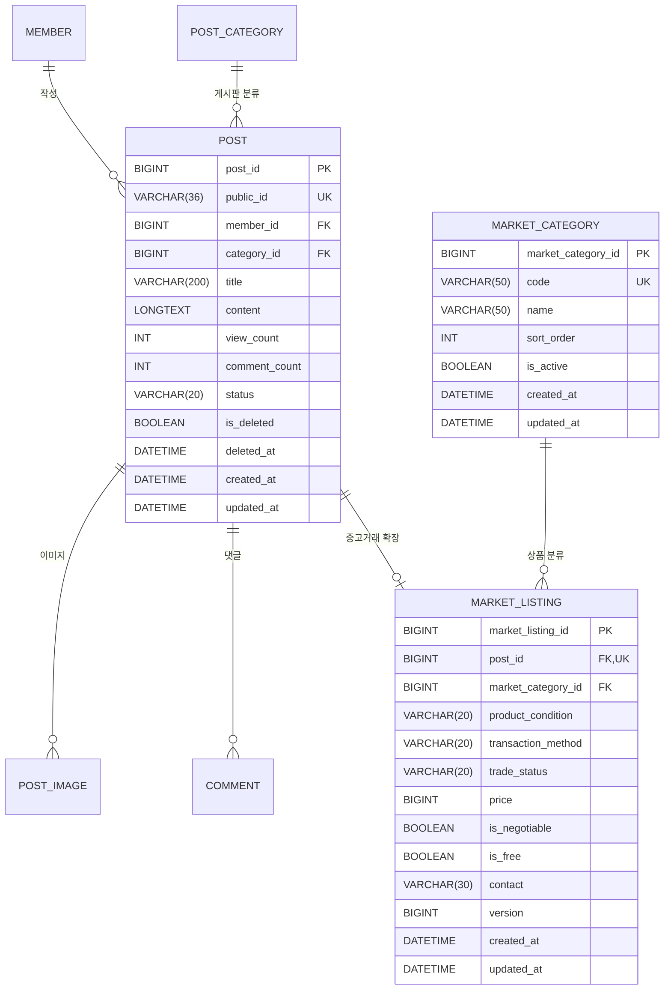

# 중고장터 ERD 및 물리 스키마

- 문서 번호: `ERD-USED-MARKET-001`
- 상태: Draft
- 작성일: 2026-09-28
- DBMS: MySQL 8.0 / InnoDB / `utf8mb4`
- 기반 문서: [`02_domain-model.md`](./02_domain-model.md)

## 1. 논리 ERD



## 2. 관계와 원본 데이터

| 정보 | 원본 테이블 | 중복 저장 여부 |
|---|---|---|
| 판매자 | `post.member_id` | `market_listing`에 저장하지 않음 |
| 제목·본문 | `post` | 중복 저장하지 않음 |
| 조회수·댓글 수 | `post` | 중복 저장하지 않음 |
| 이미지 | `post_image` | 중고장터 전용 이미지 테이블 없음 |
| 게시글 운영 상태 | `post.status`, `post.is_deleted` | 중복 저장하지 않음 |
| 상품 분류 | `market_category` | `market_listing`은 FK만 저장 |
| 가격·상품·거래 상태 | `market_listing` | 거래 도메인의 원본 |
| 수정 버전 | `market_listing.version` | 판매글 수정 충돌의 원본 |

`post.category_id`는 코드 `MARKET`인 `post_category`를 가리킨다. 상품 종류는 별도의 `market_category_id`로 관리한다.

## 3. 물리 테이블

### 3.1. `market_category`

| 컬럼 | 타입 | 제약 | 설명 |
|---|---|---|---|
| `market_category_id` | `BIGINT` | PK, AUTO_INCREMENT | 내부 식별자 |
| `code` | `VARCHAR(50)` | NOT NULL, UNIQUE | API 식별 코드 |
| `name` | `VARCHAR(50)` | NOT NULL | 표시명 |
| `sort_order` | `INT` | NOT NULL | 노출 순서 |
| `is_active` | `BOOLEAN` | NOT NULL, DEFAULT TRUE | 신규 선택 가능 여부 |
| `created_at` | `DATETIME` | NOT NULL | 생성 시각 |
| `updated_at` | `DATETIME` | NOT NULL | 수정 시각 |

```sql
CREATE TABLE `market_category` (
    `market_category_id` BIGINT AUTO_INCREMENT PRIMARY KEY,
    `code` VARCHAR(50) NOT NULL,
    `name` VARCHAR(50) NOT NULL,
    `sort_order` INT NOT NULL,
    `is_active` BOOLEAN NOT NULL DEFAULT TRUE,
    `created_at` DATETIME NOT NULL DEFAULT CURRENT_TIMESTAMP,
    `updated_at` DATETIME NOT NULL DEFAULT CURRENT_TIMESTAMP ON UPDATE CURRENT_TIMESTAMP,
    CONSTRAINT `uk_market_category_code` UNIQUE (`code`),
    CONSTRAINT `chk_market_category_sort_order` CHECK (`sort_order` >= 0),
    INDEX `idx_market_category_active_sort` (`is_active`, `sort_order`, `market_category_id`)
) ENGINE=InnoDB DEFAULT CHARSET=utf8mb4 COLLATE=utf8mb4_unicode_ci;
```

### 3.2. `market_listing`

| 컬럼 | 타입 | 제약 | 설명 |
|---|---|---|---|
| `market_listing_id` | `BIGINT` | PK, AUTO_INCREMENT | 내부 식별자 |
| `post_id` | `BIGINT` | FK, NOT NULL, UNIQUE | 기존 게시글 1:1 관계 |
| `market_category_id` | `BIGINT` | FK, NOT NULL | 상품 분류 |
| `product_condition` | `VARCHAR(20)` | NOT NULL | 상품 상태 |
| `transaction_method` | `VARCHAR(20)` | NOT NULL | 거래 방식 |
| `trade_status` | `VARCHAR(20)` | NOT NULL | 거래 상태 |
| `price` | `BIGINT` | NOT NULL | 원 단위 가격 |
| `is_negotiable` | `BOOLEAN` | NOT NULL | 가격 협의 가능 여부 |
| `is_free` | `BOOLEAN` | NOT NULL | 무료 나눔 여부 |
| `contact` | `VARCHAR(30)` | NOT NULL | 연락처 자유 입력값 |
| `version` | `BIGINT` | NOT NULL, DEFAULT 0 | 낙관적 락 버전 |
| `created_at` | `DATETIME` | NOT NULL | 등록 시각 |
| `updated_at` | `DATETIME` | NOT NULL | 최종 수정 시각 |

```sql
CREATE TABLE `market_listing` (
    `market_listing_id` BIGINT AUTO_INCREMENT PRIMARY KEY,
    `post_id` BIGINT NOT NULL,
    `market_category_id` BIGINT NOT NULL,
    `product_condition` VARCHAR(20) NOT NULL,
    `transaction_method` VARCHAR(20) NOT NULL,
    `trade_status` VARCHAR(20) NOT NULL DEFAULT 'ON_SALE',
    `price` BIGINT NOT NULL,
    `is_negotiable` BOOLEAN NOT NULL DEFAULT FALSE,
    `is_free` BOOLEAN NOT NULL DEFAULT FALSE,
    `contact` VARCHAR(30) NOT NULL,
    `version` BIGINT NOT NULL DEFAULT 0,
    `created_at` DATETIME NOT NULL DEFAULT CURRENT_TIMESTAMP,
    `updated_at` DATETIME NOT NULL DEFAULT CURRENT_TIMESTAMP ON UPDATE CURRENT_TIMESTAMP,
    CONSTRAINT `uk_market_listing_post` UNIQUE (`post_id`),
    CONSTRAINT `fk_market_listing_post`
        FOREIGN KEY (`post_id`) REFERENCES `post` (`post_id`),
    CONSTRAINT `fk_market_listing_category`
        FOREIGN KEY (`market_category_id`) REFERENCES `market_category` (`market_category_id`),
    CONSTRAINT `chk_market_listing_condition`
        CHECK (`product_condition` IN ('NEW', 'LIKE_NEW', 'GOOD', 'USED', 'DAMAGED')),
    CONSTRAINT `chk_market_listing_transaction_method`
        CHECK (`transaction_method` IN ('DIRECT', 'DELIVERY', 'BOTH')),
    CONSTRAINT `chk_market_listing_trade_status`
        CHECK (`trade_status` IN ('ON_SALE', 'RESERVED', 'SOLD')),
    CONSTRAINT `chk_market_listing_price_non_negative`
        CHECK (`price` >= 0),
    CONSTRAINT `chk_market_listing_price_mode`
        CHECK ((`is_free` = TRUE AND `price` = 0 AND `is_negotiable` = FALSE)
            OR (`is_free` = FALSE AND `price` BETWEEN 1 AND 20000000)),
    CONSTRAINT `chk_market_listing_contact`
        CHECK (CHAR_LENGTH(TRIM(`contact`)) BETWEEN 1 AND 30),
    INDEX `idx_market_listing_trade_created`
        (`trade_status`, `created_at`, `market_listing_id`),
    INDEX `idx_market_listing_category_trade_created`
        (`market_category_id`, `trade_status`, `created_at`, `market_listing_id`),
    INDEX `idx_market_listing_condition_trade_created`
        (`product_condition`, `trade_status`, `created_at`, `market_listing_id`)
) ENGINE=InnoDB DEFAULT CHARSET=utf8mb4 COLLATE=utf8mb4_unicode_ci;
```

## 4. 기준 데이터

```sql
INSERT INTO `post_category` (`name`, `code`)
VALUES ('중고장터', 'MARKET')
ON DUPLICATE KEY UPDATE `name` = VALUES(`name`);

INSERT INTO `market_category` (`code`, `name`, `sort_order`, `is_active`) VALUES
('SNOWBOARD', '스노보드', 1, TRUE),
('SKI', '스키', 2, TRUE),
('BINDING', '바인딩', 3, TRUE),
('BOOTS', '부츠', 4, TRUE),
('APPAREL', '의류', 5, TRUE),
('PROTECTIVE_GEAR', '보호장비', 6, TRUE),
('ACCESSORY', '액세서리', 7, TRUE),
('PASS', '시즌권·이용권', 8, TRUE),
('OTHER', '기타', 9, TRUE)
ON DUPLICATE KEY UPDATE
    `name` = VALUES(`name`),
    `sort_order` = VALUES(`sort_order`);
```

운영 중 비활성화한 분류를 마이그레이션 재실행이 다시 활성화하지 않도록 `is_active`는 upsert 갱신 대상에서 제외한다.

## 5. 인덱스 설계

### 기본 목록

```sql
WHERE ml.trade_status IN ('ON_SALE', 'RESERVED')
  AND p.status = 'NORMAL'
  AND p.is_deleted = FALSE
ORDER BY ml.created_at DESC, ml.market_listing_id DESC
LIMIT ? OFFSET ?
```

`idx_market_listing_trade_created`가 거래 상태로 범위를 줄이고 최신순 후보를 찾는다. 두 상태의 `IN`과 Post 조인 때문에 filesort가 선택될 수 있으므로 구현 후 EXPLAIN으로 확인한다.

### 상품 분류 필터

`category + tradeStatus + createdAt + id` 순서의 인덱스를 사용한다. 상품 상태 필터도 같은 원리로 별도 인덱스를 둔다. 모든 선택 필터 조합을 하나의 거대한 인덱스로 만들면 쓰기 비용과 저장 공간이 커지므로 초기에는 주요 단일 필터 조합만 둔다.

### 제목 검색

제목 검색은 `post.title LIKE '%keyword%'`이므로 일반 B-Tree 인덱스를 활용하기 어렵다. 초기 데이터 규모에서는 JOIN 후 필터링을 허용한다. 검색 지연이 확인되면 MySQL FULLTEXT의 한국어 처리 한계, n-gram parser, 별도 검색엔진을 실측한 뒤 결정한다.

### OFFSET 한계

OFFSET은 뒤 페이지로 갈수록 앞 행을 읽고 버린다. 최대 100페이지, 페이지당 최대 50건으로 제한해 최악의 건너뛰기 범위를 제어한다. 데이터가 늘면 현재 API를 유지한 채 별도 커서 엔드포인트를 추가한다.

## 6. 삭제와 FK 정책

- 사용자 삭제는 `post` Soft Delete이므로 `market_listing`을 자동 삭제하지 않는다.
- `market_listing.post_id`에는 `ON DELETE CASCADE`를 두지 않는다. 운영에서 `post`를 실수로 물리 삭제할 때 거래 정보까지 조용히 사라지는 것을 막기 위해 기본 `RESTRICT` 동작을 사용한다.
- `market_category`도 기존 판매글이 참조하면 삭제하지 못한다. 비활성화로 운영한다.
- 회원 탈퇴 시 기존 `post.member_id` 정책에 따라 판매자 관계가 NULL이 될 수 있다. 중고장터 글의 노출·연락처 보존 여부는 회원 탈퇴 정책과 함께 재검토해야 한다.

## 7. 운영 마이그레이션

운영 SQL 후보 파일은 `database/production/004_migration_used_market.sql`이다. 설계 단계에서는 파일을 만들지 않는다.

적용 순서는 다음과 같다.

1. `market_category` 생성
2. `market_listing` 생성
3. `MARKET` 게시판 분류 upsert
4. 상품 분류 기준 데이터 upsert
5. CHECK·FK·UNIQUE·인덱스 존재 확인
6. 애플리케이션 배포

현재 운영 절차와 같이 전용 migration 계정, checksum, `schema_migration`, GitHub `production-migration` 승인 단계를 사용한다. 스키마가 먼저 배포되어도 기존 애플리케이션은 새 테이블을 참조하지 않으므로 expand 단계로 안전하게 적용할 수 있다.

롤백은 테이블을 즉시 DROP하는 방식으로 자동화하지 않는다. 애플리케이션 롤백 후 생성된 판매글 존재 여부를 확인하고, 필요하면 데이터를 보존한 채 forward fix한다.

## 8. 스키마 검증 항목

- 동일 `post_id`로 판매글 두 건 삽입 시 UNIQUE 거부
- 존재하지 않는 Post·상품 분류 FK 거부
- 지원하지 않는 Enum 문자열 거부
- 음수 가격 거부
- 무료 나눔 + 유료 가격 조합 거부
- 무료 나눔 + 가격 협의 조합 거부
- 유료 판매글 0원 거부
- `DAMAGED`도 별도 하자 설명 컬럼 없이 저장 가능
- 빈 연락처와 30자 초과 연락처 거부
- 동일 상품 분류 code 거부
- 비활성 분류를 참조한 기존 판매글 조회 유지
- migration 재실행 시 기준 데이터 중복 없음
