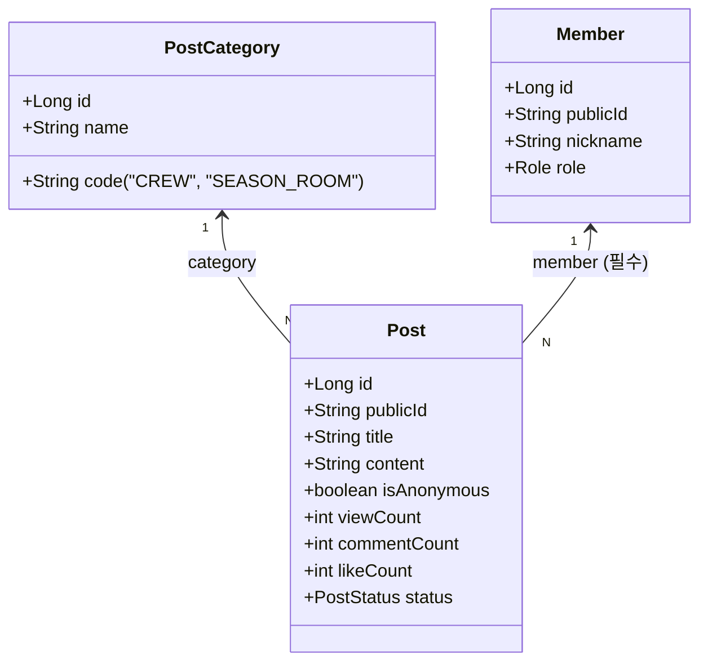

# 동호회 및 시즌방 홍보 게시판 도메인 모델

## 1. 도메인 구조 개요

기존 게시판 도메인(`Post`)을 재사용하는 범용 커뮤니티 파티셔닝 구조입니다.

## 2. 도메인 불변식 (Invariants)

1. **작성자 필수성 (Non-null Member)**:
   - `post.category.code IN ('CREW', 'SEASON_ROOM')`인 경우 `post.member`는 반드시 `NOT NULL`이어야 한다.
2. **익명성 금지 (Non-anonymous)**:
   - `post.isAnonymous`는 반드시 `false`여야 한다.
   - `post.anonymousPassword`는 반드시 `NULL`이어야 한다.
3. **카테고리 불변식**:
   - `post.category.code`는 `post_category` 테이블의 정식 등록 코드(`CREW`, `SEASON_ROOM`)여야 한다.
