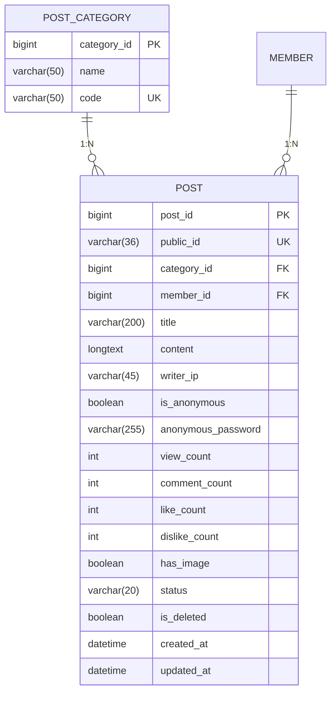

# 동호회 및 시즌방 홍보 게시판 ERD 스펙

## 1. ERD 관계도

기존 `post_category`와 `post` 테이블을 그대로 사용하며, 신규 물리 테이블 추가는 없습니다.

## 2. 신규 기준데이터 (마스터 레코드)

| category_id (자동증가) | name | code | 비고 |
|---|---|---|---|
| Auto | 동호회 모집 | `CREW` | 익명 작성 불가 |
| Auto | 시즌방 모집 | `SEASON_ROOM` | 익명 작성 불가 |
