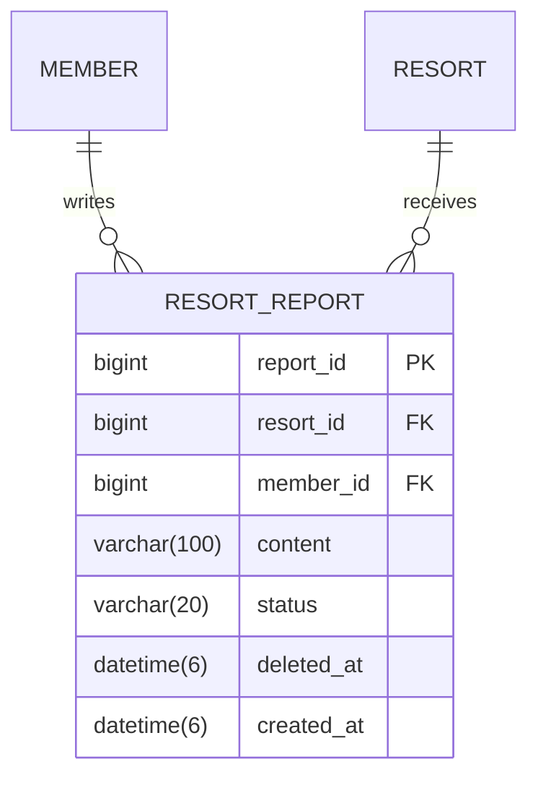

# 오늘의 설질(Resort Report) ERD 설계서



```sql
CREATE TABLE IF NOT EXISTS resort_report (
    report_id BIGINT AUTO_INCREMENT PRIMARY KEY,
    resort_id BIGINT NOT NULL,
    member_id BIGINT NOT NULL,
    content VARCHAR(100) NOT NULL,
    status VARCHAR(20) NOT NULL DEFAULT 'NORMAL',
    deleted_at DATETIME(6) NULL,
    created_at DATETIME(6) NOT NULL DEFAULT CURRENT_TIMESTAMP(6),
    CONSTRAINT fk_resort_report_resort FOREIGN KEY (resort_id) REFERENCES resort (resort_id) ON DELETE CASCADE,
    CONSTRAINT fk_resort_report_member FOREIGN KEY (member_id) REFERENCES member (member_id) ON DELETE CASCADE,
    INDEX idx_resort_report_status_created (status, created_at DESC, report_id DESC),
    INDEX idx_resort_report_resort_status_created (resort_id, status, created_at DESC, report_id DESC),
    INDEX idx_resort_report_member_created (member_id, created_at DESC)
);
```

## 인덱스 근거

- `status, created_at, report_id`: 공개 전체 목록의 상태 동등 조건, 당일 범위, 안정적인 최신순 정렬을 지원한다.
- `resort_id, status, created_at, report_id`: 리조트 필터의 동등 조건을 선두에 배치한다.
- `member_id, created_at`: 상태와 무관하게 회원별 당일 작성량을 집계한다.
- 인덱스가 쓰기·삭제 비용과 저장 공간을 늘리는 대가가 있지만, 현재 기능의 세 가지 핵심 쿼리를 테이블 전체 스캔하지 않게 한다.
