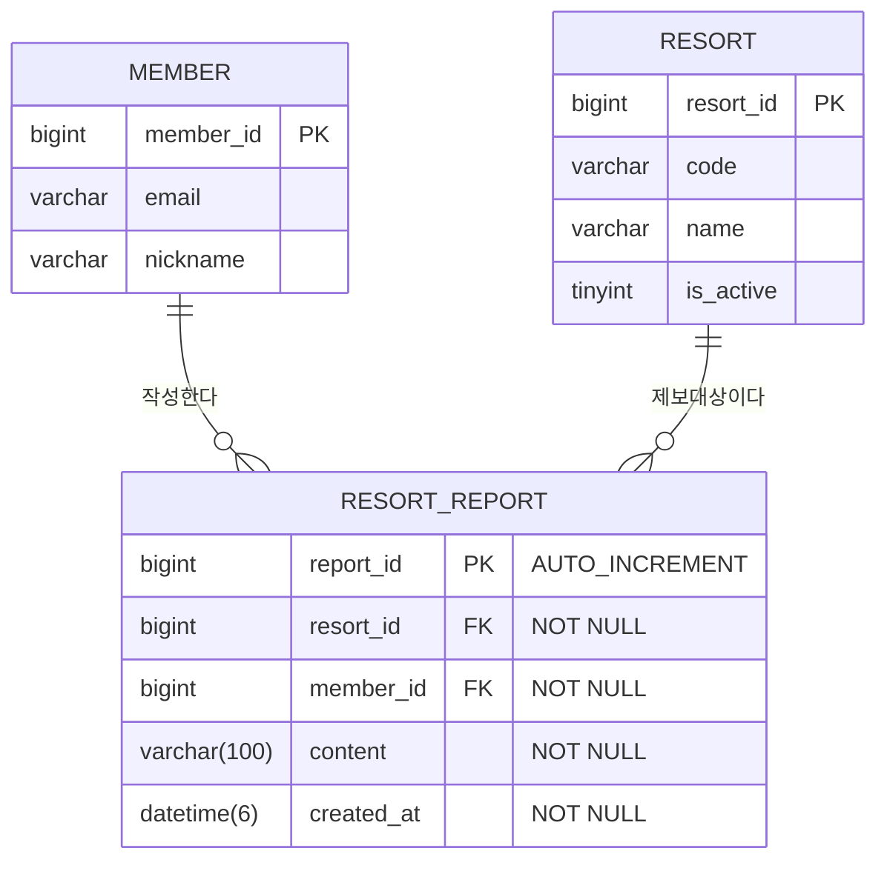

# 오늘의 설질(Resort Report) ERD 설계서

## 1. ERD 다이어그램



## 2. 테이블 스키마 DDL 정의

```sql
CREATE TABLE IF NOT EXISTS resort_report (
    report_id BIGINT AUTO_INCREMENT PRIMARY KEY,
    resort_id BIGINT NOT NULL,
    member_id BIGINT NOT NULL,
    content VARCHAR(100) NOT NULL,
    created_at DATETIME(6) NOT NULL DEFAULT CURRENT_TIMESTAMP(6),
    CONSTRAINT fk_resort_report_resort FOREIGN KEY (resort_id) REFERENCES resort (resort_id) ON DELETE CASCADE,
    CONSTRAINT fk_resort_report_member FOREIGN KEY (member_id) REFERENCES member (member_id) ON DELETE CASCADE,
    INDEX idx_resort_report_created_resort (created_at DESC, resort_id)
) ENGINE=InnoDB DEFAULT CHARSET=utf8mb4 COLLATE=utf8mb4_unicode_ci;
```

## 3. 인덱스 설계 근거
- **`idx_resort_report_created_resort (created_at DESC, resort_id)`**:
  - 오늘의 설질 조회는 기본적으로 `created_at >= :todayStart` 범위 조건을 최우선으로 필터링하며, 리조트별 필터링(`resort_id = :resortId`) 및 최신순 정렬(`ORDER BY created_at DESC`)을 동시 수행하므로 Range Scan 및 정렬 부하(FileSort)를 원천 방지한다.
