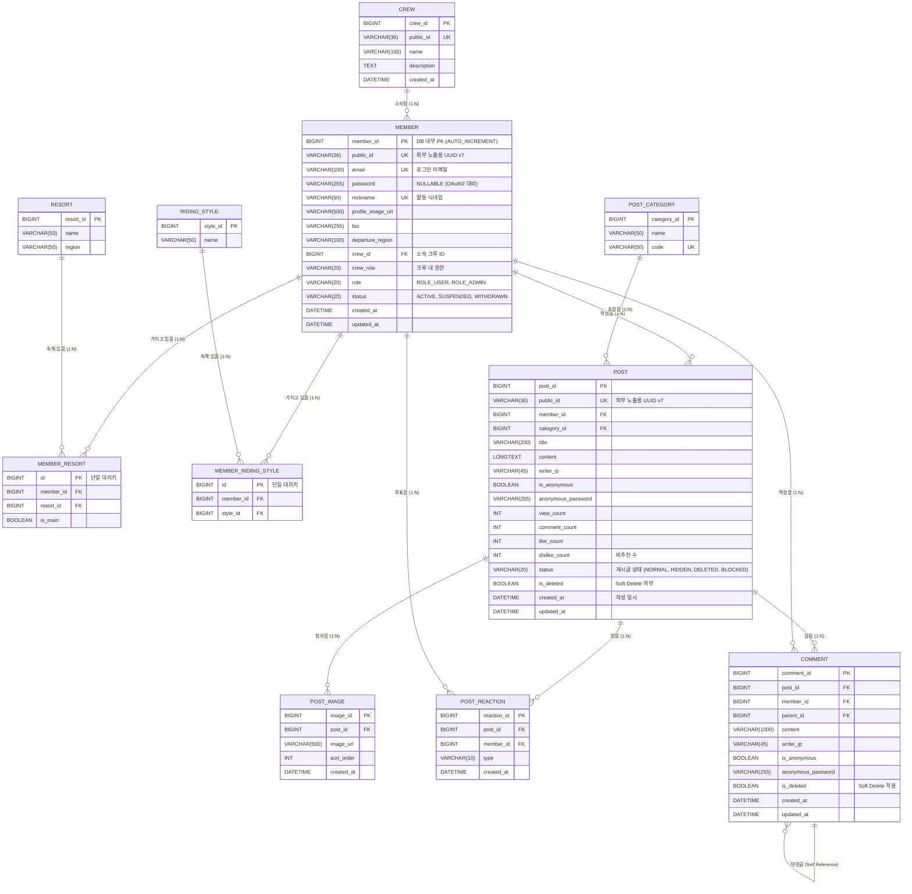

# 데이터베이스 설계 및 ERD (Database ERD Specification)

## 1. 개요 (Overview)

Snowthing 서비스의 회원(Member), 크루(Crew), 및 게시판(Post/Comment) 중심 핵심 데이터베이스 설계 문서입니다.
RDBMS 고유의 정규화 원칙(N:M 관계 중계 테이블 분리), 보안 및 성능을 고려한 PK 전략(내부 `BIGINT id` + 외부 노출용 `public_id` UUID), 역정규화 컬럼 및 소프트 삭제(Soft Delete) 정책을 엄격히 적용하여 설계되었습니다.

---

## 2. Mermaid ERD 다이어그램 (ER Diagram)

---

## 3. 엔티티 상세 명세 (Entity Details)

### 3.1. 회원, 크루 및 프로필 관련 엔티티

#### 1) `member` (회원 마스터)
| 컬럼명 | 데이터 타입 | 제약 조건 | 설명 |
| :--- | :--- | :--- | :--- |
| `member_id` | BIGINT | PK, AUTO_INCREMENT | DB 내부 조인용 고유 PK |
| `public_id` | VARCHAR(36) | UNIQUE, NOT NULL, INDEX | **외부 API/URL 노출 보안용 UUID** |
| `email` | VARCHAR(100) | UNIQUE, NOT NULL, INDEX | 로그인 계정 이메일 |
| `password` | VARCHAR(255) | **NULLABLE** | BCrypt 해시 비밀번호 (**OAuth2 소셜 연동 대비**) |
| `nickname` | VARCHAR(50) | UNIQUE, NOT NULL, INDEX | 활동 닉네임 |
| `profile_image_url` | VARCHAR(500) | NULLABLE | 프로필 이미지 URL |
| `bio` | VARCHAR(255) | NULLABLE | 자기소개 한마디 |
| `departure_region` | VARCHAR(100) | NULLABLE | 주 출발/거주 지역 (예: 서울 송파구) |
| `crew_id` | BIGINT | FK (`crew.crew_id`), NULLABLE, INDEX | **소속 크루 ID (1인 1크루 소속)** |
| `crew_role` | VARCHAR(20) | NULLABLE | **크루 내 권한** (`OWNER`, `MANAGER`, `MEMBER`) |
| `role` | VARCHAR(20) | NOT NULL, DEFAULT 'ROLE_USER' | 회원 전역 권한 (`ROLE_USER`, `ROLE_ADMIN`) |
| `status` | VARCHAR(20) | NOT NULL, DEFAULT 'ACTIVE' | 계정 상태 (`ACTIVE`, `SUSPENDED`, `WITHDRAWN`) |
| `created_at` | DATETIME | NOT NULL, DEFAULT CURRENT_TIMESTAMP | 가입 일시 |
| `updated_at` | DATETIME | NOT NULL, DEFAULT CURRENT_TIMESTAMP | 정보 수정 일시 |

#### 2) `crew` (크루 마스터 - 향후 확장 대비)
| 컬럼명 | 데이터 타입 | 제약 조건 | 설명 |
| :--- | :--- | :--- | :--- |
| `crew_id` | BIGINT | PK, AUTO_INCREMENT | 크루 고유 식별자 |
| `public_id` | VARCHAR(36) | UNIQUE, NOT NULL, INDEX | 외부 노출용 UUID |
| `name` | VARCHAR(100) | NOT NULL | 크루 이름 (예: 휘팍 카빙 크루) |
| `description` | TEXT | NULLABLE | 크루 소개 |
| `created_at` | DATETIME | NOT NULL, DEFAULT CURRENT_TIMESTAMP | 크루 생성 일시 |

#### 3) `resort` (리조트 마스터)
| 컬럼명 | 데이터 타입 | 제약 조건 | 설명 |
| :--- | :--- | :--- | :--- |
| `resort_id` | BIGINT | PK, AUTO_INCREMENT | 리조트 고유 식별자 |
| `name` | VARCHAR(50) | NOT NULL | 스키장 이름 (휘닉스파크, 용평리조트 등) |
| `region` | VARCHAR(50) | NOT NULL | 스키장 위치 지역 (강원, 경기 등) |

#### 4) `member_resort` (회원-리조트 N:M 중계 테이블)
| 컬럼명 | 데이터 타입 | 제약 조건 | 설명 |
| :--- | :--- | :--- | :--- |
| `id` | BIGINT | PK, AUTO_INCREMENT | **단일 대리키 PK (JPA 복합키 복잡성 방지)** |
| `member_id` | BIGINT | FK (`member.member_id`), NOT NULL | 회원 ID |
| `resort_id` | BIGINT | FK (`resort.resort_id`), NOT NULL | 리조트 ID |
| `is_main` | BOOLEAN | NOT NULL, DEFAULT FALSE | 주 베이스 스키장 여부 |
| **복합 유니크** | - | `UNIQUE (member_id, resort_id)` | **중복 베이스 등록 방지** |

#### 5) `riding_style` (라이딩 스타일 마스터)
| 컬럼명 | 데이터 타입 | 제약 조건 | 설명 |
| :--- | :--- | :--- | :--- |
| `style_id` | BIGINT | PK, AUTO_INCREMENT | 스타일 고유 식별자 |
| `name` | VARCHAR(50) | NOT NULL | 라이딩 스타일명 (카빙, 트릭, 파크, 입문 등) |

#### 6) `member_riding_style` (회원-라이딩스타일 N:M 중계 테이블)
| 컬럼명 | 데이터 타입 | 제약 조건 | 설명 |
| :--- | :--- | :--- | :--- |
| `id` | BIGINT | PK, AUTO_INCREMENT | **단일 대리키 PK (JPA 복합키 복잡성 방지)** |
| `member_id` | BIGINT | FK (`member.member_id`), NOT NULL | 회원 ID |
| `style_id` | BIGINT | FK (`riding_style.style_id`), NOT NULL | 라이딩 스타일 ID |
| **복합 유니크** | - | `UNIQUE (member_id, style_id)` | **중복 스타일 등록 방지** |

---

### 3.2. 게시판 및 소통 관련 엔티티

#### 7) `post_category` (게시판 카테고리)
| 컬럼명 | 데이터 타입 | 제약 조건 | 설명 |
| :--- | :--- | :--- | :--- |
| `category_id` | BIGINT | PK, AUTO_INCREMENT | 카테고리 식별자 |
| `name` | VARCHAR(50) | NOT NULL | 카테고리명 (자유게시판, 질문, 장비VS, 맛집) |
| `code` | VARCHAR(50) | UNIQUE, NOT NULL | 카테고리 코드 (`FREE`, `QNA`, `GEAR_VS`, `FOOD`) |

#### 8) `post` (게시글)
| 컬럼명 | 데이터 타입 | 제약 조건 | 설명 |
| :--- | :--- | :--- | :--- |
| `post_id` | BIGINT | PK, AUTO_INCREMENT | 게시글 고유 식별자 |
| `public_id` | VARCHAR(36) | UNIQUE, NOT NULL, INDEX | **외부 API/URL 노출 보안용 UUID** |
| `member_id` | BIGINT | FK (`member.member_id`), INDEX, NULLABLE | 작성자 ID (비회원 작성 시 NULL) |
| `category_id` | BIGINT | FK (`post_category.category_id`), INDEX, NOT NULL | 카테고리 ID |
| `title` | VARCHAR(200) | NOT NULL | 게시글 제목 |
| `content` | LONGTEXT | NOT NULL | 게시글 본문 |
| `writer_ip` | VARCHAR(45) | NOT NULL | 작성자 IP 주소 |
| `is_anonymous` | BOOLEAN | NOT NULL, DEFAULT FALSE | 익명 작성 여부 |
| `anonymous_password` | VARCHAR(255) | NULLABLE | 비회원 익명 비밀번호 (BCrypt) |
| `view_count` | INT | NOT NULL, DEFAULT 0 | 조회수 |
| `comment_count` | INT | NOT NULL, DEFAULT 0 | **댓글 수 역정규화** |
| `like_count` | INT | NOT NULL, DEFAULT 0 | **추천 수 역정규화** |
| `dislike_count` | INT | NOT NULL, DEFAULT 0 | **비추천 수 역정규화** |
| `status` | VARCHAR(20) | NOT NULL, DEFAULT 'NORMAL' | 게시글 상태 (`NORMAL`, `HIDDEN`, `DELETED`, `BLOCKED`) |
| `is_deleted` | BOOLEAN | NOT NULL, DEFAULT FALSE | **Soft Delete** 여부 |
| `created_at` | DATETIME | NOT NULL, DEFAULT CURRENT_TIMESTAMP, INDEX | 작성 일시 |
| `updated_at` | DATETIME | NOT NULL, DEFAULT CURRENT_TIMESTAMP | 수정 일시 |

#### 9) `post_image` (게시글 첨부 이미지 1:N)
| 컬럼명 | 데이터 타입 | 제약 조건 | 설명 |
| :--- | :--- | :--- | :--- |
| `image_id` | BIGINT | PK, AUTO_INCREMENT | 이미지 식별자 |
| `post_id` | BIGINT | FK (`post.post_id`), INDEX, NOT NULL | 게시글 ID |
| `image_url` | VARCHAR(500) | NOT NULL | 이미지 파일 저장 URL |
| `sort_order` | INT | NOT NULL, DEFAULT 1 | 이미지 표시 순서 |
| `created_at` | DATETIME | NOT NULL, DEFAULT CURRENT_TIMESTAMP | 등록 일시 |

#### 10) `post_reaction` (게시글 추천/비추천 N:M 중계 테이블)
| 컬럼명 | 데이터 타입 | 제약 조건 | 설명 |
| :--- | :--- | :--- | :--- |
| `reaction_id` | BIGINT | PK, AUTO_INCREMENT | 반응 식별자 |
| `post_id` | BIGINT | FK (`post.post_id`), NOT NULL | 게시글 ID |
| `member_id` | BIGINT | FK (`member.member_id`), NOT NULL | 회원 ID |
| `type` | VARCHAR(10) | NOT NULL | 반응 종별 (`LIKE`: 추천, `DISLIKE`: 비추천) |
| `created_at` | DATETIME | NOT NULL, DEFAULT CURRENT_TIMESTAMP | 투표 일시 |
| **복합 유니크** | - | `UNIQUE (post_id, member_id)` | **게시글당 회원 1회만 중복 방지** |

#### 11) `comment` (댓글 & 계층형 대댓글)
| 컬럼명 | 데이터 타입 | 제약 조건 | 설명 |
| :--- | :--- | :--- | :--- |
| `comment_id` | BIGINT | PK, AUTO_INCREMENT | 댓글 식별자 |
| `post_id` | BIGINT | FK (`post.post_id`), INDEX, NOT NULL | 게시글 ID |
| `member_id` | BIGINT | FK (`member.member_id`), NULLABLE | 작성자 ID (비회원 작성 시 NULL) |
| `parent_id` | BIGINT | FK (`comment.comment_id`), INDEX, NULLABLE | **부모 댓글 ID (대댓글 구현용)** |
| `content` | VARCHAR(1000) | NOT NULL | 댓글 내용 |
| `writer_ip` | VARCHAR(45) | NOT NULL | 작성자 IP 주소 |
| `is_anonymous` | BOOLEAN | NOT NULL, DEFAULT FALSE | 익명 작성 여부 |
| `anonymous_password` | VARCHAR(255) | NULLABLE | 비회원 익명 비밀번호 (BCrypt) |
| `is_deleted` | BOOLEAN | NOT NULL, DEFAULT FALSE | **Soft Delete** 적용 |
| `created_at` | DATETIME | NOT NULL, DEFAULT CURRENT_TIMESTAMP | 작성 일시 |
| `updated_at` | DATETIME | NOT NULL, DEFAULT CURRENT_TIMESTAMP | 수정 일시 |

---

## 4. 최종 아키텍처 및 스키마 설계 주요 특징

1. **PK 전략 (BIGINT 내부 id + public_id UUID)**
   * DB 내부 조인/인덱스는 8바이트 정수 `id`가 수행하여 성능을 효율적으로 보장합니다.
   * 외부에 노출되는 URL/API에는 추측 불가능한 `public_id` (36자리 UUID)를 사용하여 무단 크롤링을 차단합니다.
2. **중계 테이블 단일 대리키 (`id`) 적용**
   * 중계 테이블(`member_resort`, `member_riding_style`)에 복합 PK 대신 단일 `id` PK를 적용하여 JPA `@EmbeddedId` 복합키 복잡성을 제거하고, `UNIQUE` 제약조건으로 데이터 무결성을 보장합니다.
3. **RDBMS 정석 정규화 N:M 구조**
   * 다중 선택(베이스 스키장, 라이딩 스타일)을 정석적인 중계 테이블로 풀어내어 1차 정규화 및 FK 무결성을 보장합니다.
4. **크루(Crew) 및 OAuth2 확장성 미리 반영**
   * `member` 테이블에 `crew_id` (FK), `crew_role` 컬럼을 구성하여 1인 1크루 소속 구조를 준비하고, `password`를 `NULLABLE`로 설정하여 OAuth2 소셜 로그인 도입에 대비했습니다.
