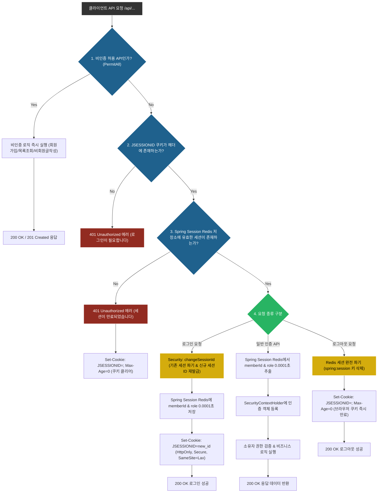

# 세션 기반 인증 및 인가 설계 (Authentication & Session Design)

## 1. 개요 (Overview)

Snowthing 1차 MVP 서비스는 **HTTP Cookie & Spring Session Redis 인메모리 기반의 인증/인가 시스템**을 채택합니다.
단일 서버 메모리가 아닌 **Redis 7.x 인메모리 분산 세션 저장소(Spring Session Redis)**에 `spring:session:sessions:JSESSIONID` 키 형태로 0.0001초 만에 세션 데이터를 초고속 저장 및 검증합니다.
서버를 여러 대 스케일 아웃(Scale-out)해도 세션이 끊기지 않는 **분산 세션 아키텍처**를 보장하며, DB I/O 부하 0%를 달성합니다.

---

## 2. 로그인 세션 인증 흐름 (Authentication Flow)

```
[Client]                                       [Server (Spring Boot)]                  [Redis 7.x]
   |                                                      |                                 |
   | --- 1. POST /api/auth/login (email, password) -----> |                                 |
   |                                                      | --- 2. BCrypt 패스워드 검증       |
   |                                                      | --- 3. Spring Session Redis 생성 -> | (spring:session:sessions:JSESSIONID)
   |                                                      |     (memberId, role 0.0001s 저장) |
   |                                                      | --- 4. changeSessionId()        |
   |                                                      |     (세션 고정 공격 방어)         |
   | <--- 5. 200 OK + Set-Cookie (JSESSIONID=...) ------- |                                 |
```

1. **클라이언트 요청**: 이메일과 비밀번호를 담아 로그인 요청을 보냅니다.
2. **비밀번호 검증**: DB에 저장된 BCrypt 해시 비밀번호와 일치하는지 검증합니다.
3. **Redis 세션 생성 및 저장**: 검증 성공 시 **Spring Session Redis 저장소(RAM)**에 0.0001초 만에 세션을 생성하고 최소 식별 정보(`memberId`, `role`)만 저장합니다. (DB I/O 0%)
4. **세션 ID 재발급**: 세션 고정 공격(Session Fixation)을 방지하기 위해 세션 ID를 재발급(`changeSessionId()`)합니다.
5. **쿠키 발급**: 응답 헤더의 `Set-Cookie`를 통해 식별자 쿠키를 클라이언트에 전달합니다.

---

## 2. 세션 인증 순서도 (Session Authentication Flowchart)

Below is the Mermaid flowchart rendered directly in GitHub Markdown and Notion.



---

## 3. 쿠키 보안 정책 (Cookie Security Policy)

세션 식별자(`JSESSIONID`) 쿠키에는 다음 6가지 엄격한 보안 속성을 적용합니다.

```http
Set-Cookie: JSESSIONID=A1B2C3D4...; Path=/api; HttpOnly; Secure; SameSite=Lax
```

| 보안 속성 | 설정값 | 방어 목적 및 세부 설명 |
| :--- | :--- | :--- |
| **HttpOnly** | `true` | 자바스크립트(`document.cookie`)를 통한 접근 차단 (XSS 세션 탈취 방어) |
| **Secure** | `true` | HTTPS 암호화 채널에서만 쿠키 전송 (로컬 개발 환경에서는 조건부 처리) |
| **SameSite** | `Lax` | 서드파티 사이트발 요청 차단하되, 일반 이동 시 쿠키 유지 (CSRF 방어) |
| **Path** | `/api` | 백엔드 API 경로에서만 세션 쿠키 전송 |
| **Max-Age / Expires** | 미지정 (Session Cookie) | 브라우저 종료 시 클라이언트 단에서 자동 삭제되는 세션 쿠키 방식 사용 |
| **개인정보 금지** | 적용 | 쿠키에는 오직 난수화된 `JSESSIONID`만 저장하며 개인정보 저장 절대 금지 |

---

## 4. 권한 체계 및 게시글 상태별 접근 제어 인가 정책 (Authorization Rules)

### 4.1. 3단계 사용자 권한 체계

1. **`GUEST` (비회원 유저)**:
   * 로그인하지 않은 상태. 게시글 목록/상세 및 댓글 목록을 자유롭게 조회 가능.
   * 비회원 익명 작성(게시글/댓글) 가능. 수정 및 삭제 시 비회원 비밀번호(`anonymous_password` BCrypt) 입력 검증 필수.
   * 게시글 상태가 `NORMAL` 인 글만 조회 가능 (`HIDDEN`/`BLOCKED` 조회 불가).
2. **`ROLE_USER` (일반 회원)**:
   * 로그인 완료된 정식 회원. 내 프로필 관리, 회원 비익명/익명 글 및 댓글 작성, 추천/비추천 투표 가능.
   * 본인 작성 글/댓글에 대해 수정 및 삭제 가능 (세션 `memberId == DB memberId`).
3. **`ROLE_ADMIN` (관리자)**:
   * 서비스 관리 권한. 모든 글/댓글에 대해 **게시글 상태 변경(`status`: `NORMAL` ➔ `HIDDEN` / `BLOCKED`) 및 강제 삭제** 가능.
   * `HIDDEN`(숨김) 및 `BLOCKED`(차단) 처리된 글 목록 조회가 가능하며 관리자 전용 관리판에 접근 가능.

---

### 4.2. 게시글 상태 (`status`)별 조회 인가 규칙

* **`NORMAL` (정상)**: 모든 유저(`GUEST`, `ROLE_USER`, `ROLE_ADMIN`)에게 정상 노출.
* **`HIDDEN` (관리자 숨김)**: 일반 유저(`GUEST`, `ROLE_USER`) 목록/상세 조회 시 `404 Not Found` 처리. 관리자(`ROLE_ADMIN`)에게만 노출.
* **`DELETED` (Soft Delete)**: 유저/비회원이 삭제한 글. 목록에서 제외 처리.
* **`BLOCKED` (차단)**: 부적절한 게시글로 차단된 글. 일반 유저 접근 시 `403 Forbidden` (`ACCESS_DENIED`) 반환.

---

## 5. 세션 만료 및 로그아웃 정책 (Session Expiration & Logout)

* **세션 만료 (Idle Timeout)**: 30분 동안 비활동 시 **Redis 세션 저장소(`spring:session`)에서 세션 키가 자동 삭제/만료** 처리됩니다.
* **로그아웃 처리**:
  * 클라이언트 로그아웃 요청 (`POST /api/auth/logout`) 수신 시 `session.invalidate()`를 호출하여 **Redis의 세션 키를 0.0001초 만에 완전 파기**합니다.
  * 응답 시 `JSESSIONID` 쿠키의 `Max-Age`를 0으로 설정하여 클라이언트 쿠키를 즉시 만료시킵니다.
