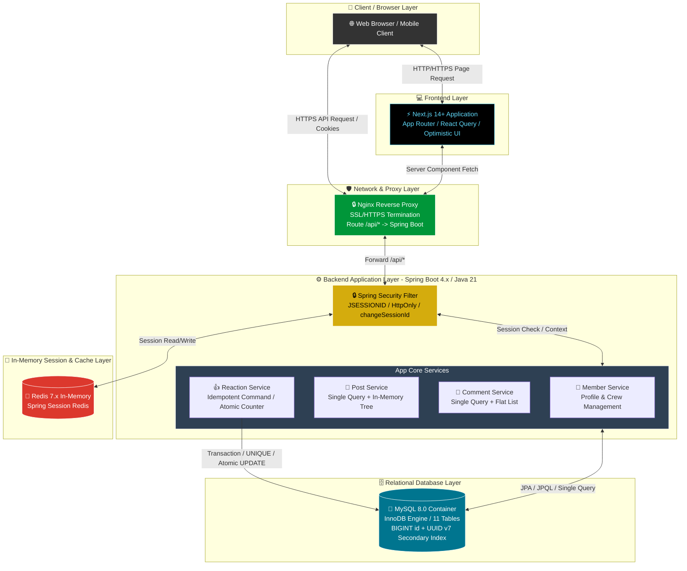

# Snowthing 전체 시스템 구성도 (System Architecture Specification)

## 1. 개요 (Overview)

Snowthing 플랫폼의 클라이언트(Next.js 14+), 리버스 프록시(Nginx), 백엔드 애플리케이션(Spring Boot 4.x / Java 21), 인메모리 분산 세션 및 캐시(Redis 7.x), 그리고 RDBMS(MySQL 8.0) 간의 **전체 시스템 아키텍처 구성도(System Architecture Diagram)** 명세서입니다.

---

## 2. 전체 시스템 구성도 (Mermaid System Architecture)

Below is the system architecture diagram rendered directly in GitHub Markdown and Notion.

---

## 3. 계층별 역할 및 구성 요소 명세 (Layer Specifications)

### 3.1. 프론트엔드 레이어 (`Frontend Layer`)
* **기술 스택**: Next.js 14+ (App Router), TypeScript, React Query
* **주요 역할**:
  * 사용자 UI/UX 렌더링 및 **낙관적 업데이트(Optimistic UI Update)**를 통한 빠른 추천 반응성 제공.
  * 서버 컴포넌트(RSC)를 활용한 SEO 최적화.

### 3.2. 프록시 & 네트워크 레이어 (`Network & Proxy Layer`)
* **기술 스택**: Nginx Reverse Proxy
* **주요 역할**:
  * SSL/HTTPS 보안 암호화 종단(Termination).
  * URL 라우팅: `/api/*` 요청은 백엔드 8080포트로, 일반 화면 요청은 3000포트로 전달.
  * `Set-Cookie` 보안 속성 (`Path=/api`, `HttpOnly`, `Secure`, `SameSite=Lax`) 보장.

### 3.3. 백엔드 애플리케이션 레이어 (`Backend Application Layer`)
* **기술 스택**: **Spring Boot 4.x**, **Java 21 (LTS)**, Spring Security, Spring Data JPA
* **주요 역할**:
  * **보안 & 분산 세션 관리**: `request.changeSessionId()` 기반 세션 고정 공격 방어 및 **Spring Session Redis (RAM 인메모리)** 연동.
  * **게시글 & 댓글 계층형 조립**: `Single Query + In-Memory Tree Reassembly` 방식을 적용하여 N+1 쿼리 완전 파괴.
  * **추천 정합성**: `post_reaction` row와 역정규화 카운터를 같은 MySQL 트랜잭션에서 변경하고 원자적 UPDATE와 UNIQUE로 보호.

### 3.4. 인메모리 세션 & 캐시 레이어 (`In-Memory Session & Cache Layer`)
* **기술 스택**: Redis 7.x
* **주요 역할**:
  * **Spring Session Redis**: `spring:session:sessions:JSESSIONID` 키 기반 분산 세션 저장소 (DB I/O 0%).
  * 추천 중복 방지와 카운터의 원본 저장소로 사용하지 않으며, 추천 정합성은 MySQL이 담당합니다.

### 3.5. 데이터베이스 레이어 (`Relational Database Layer`)
* **기술 스택**: MySQL 8.0 (InnoDB Engine, Docker Container)
* **주요 역할**:
  * 총 11개 정규화 테이블 및 RDBMS FK 참조 무결성 수호.
  * **PK 전략**: 내부 `BIGINT id` (클러스터드 인덱스) + 외부 보안 `public_id` (UUID v7 세컨더리 인덱스).
