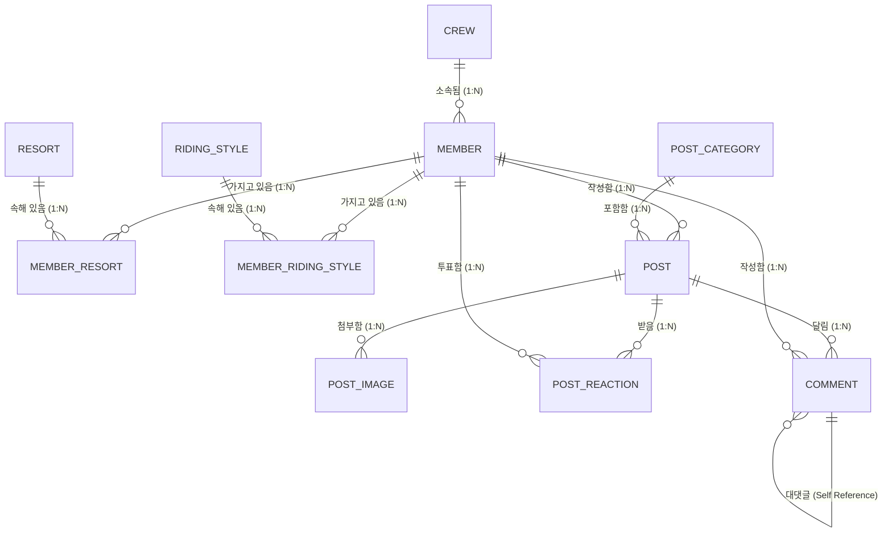

# 📚 [스터디 명세서] 회원 엔티티, DB 테이블 관계/제약조건, 회원가입 검증 & 테스트 코드 딥다이브

> **본 문서는 노션(Notion)에 그대로 복사하여 독학할 수 있도록 작성된 스터디 명세서입니다.**
> 데이터베이스 전체 11개 테이블의 **관계(Relationships), 제약조건(Constraints), 설계 이유(Rationale)**부터 백엔드 자바 소스코드 인용 해설, 회원가입 10단계 실행 순서도, 테스트 코드 작성법까지 1:1로 정밀 파헤칩니다.

---

# PART 0. DB 테이블 구조, 엔티티 간 관계, 제약조건 & 설계 비하인드

---

## 0.1 전체 11개 테이블 엔티티 간 관계도 (Entity Relationship Overview)



### 🔗 핵심 관계 요약 (Relationships)

1. **`crew` ➔ `member` (1:N 관계)**:
   * 1개의 크루는 여러 명의 회원을 가집니다. 회원은 1개의 크루에만 소속될 수 있습니다 (`crew_id` FK).
2. **`member` ↔ `resort` (N:M 관계 ➔ `member_resort` 중계 테이블 분리)**:
   * 회원은 주 베이스 스키장 등 여러 스키장을 선택할 수 있고, 스키장 역시 여러 회원을 가집니다. 정석 정규화를 위해 중계 테이블로 풀어냈습니다.
3. **`member` ↔ `riding_style` (N:M 관계 ➔ `member_riding_style` 중계 테이블 분리)**:
   * 회원은 카빙, 트릭, 파크 등 여러 라이딩 스타일을 다중 선택할 수 있습니다.
4. **`member` ➔ `post` (1:N 관계)** & **`post_category` ➔ `post` (1:N 관계)**:
   * 회원은 여러 게시글을 작성할 수 있으며, 게시글은 카테고리 하나에 반드시 속합니다. (비회원 작성 시 `member_id` 는 NULL).
5. **`comment` ➔ `comment` (Self-Reference 1:N 대댓글 관계)**:
   * 댓글 상단에 부모 댓글 ID (`parent_id` FK)를 두어, 계층형 대댓글 구조를 정석으로 지원합니다.

---

## 0.2 11개 테이블별 제약조건(Constraints) 및 설계 이유 (Why & How)

---

### 1) `member` (회원 마스터 테이블)

| 컬럼명 | 데이터 타입 | 제약 조건 (Constraints) | 설계 이유 & 왜 이렇게 만들었는가? |
| :--- | :--- | :--- | :--- |
| `member_id` | BIGINT | **PK, AUTO_INCREMENT** | **DB 내부 조인 최적화**: 8바이트 정수를 클러스터드 인덱스 PK로 삼아 DB RAM 메모리를 4배 아끼고 조인 성능을 극대화함. |
| `public_id` | VARCHAR(36) | **UNIQUE, NOT NULL, INDEX** | **외부 노출 보안 (UUID v7)**: URL 파라미터(`/api/members/a3b2...`)에 정수 ID를 숨겨 해커의 파라미터 변조(ID Enumeration) 및 무단 크롤링을 차단함. |
| `email` | VARCHAR(100) | **UNIQUE, NOT NULL, INDEX** | **로그인 계정 무결성**: 동일 이메일로 다중 가입되는 것을 DB 레벨에서 100% 원천 차단함. |
| `password` | VARCHAR(255) | **NULLABLE** | **OAuth2 소셜 연동 대비**: 카카오/구글 소셜 가입 유저는 비번이 없으므로, 테이블 재설계 없이 소셜 로그인을 수용하기 위해 NULLABLE 허용. |
| `nickname` | VARCHAR(50) | **UNIQUE, NOT NULL, INDEX** | **유저 식별성**: 커뮤니티 내 닉네임 중복을 방지하여 유저 간 혼선을 차단함. |
| `crew_id` | BIGINT | **FK (`crew.crew_id`), NULLABLE** | **크루 탈퇴 시 안전성**: `ON DELETE SET NULL` 제약조건을 걸어 크루가 해산되어 삭제되어도 회원 데이터가 함께 지워지지 않고 NULL로만 변경되도록 보존함. |
| `role` | VARCHAR(20) | **NOT NULL, DEFAULT 'ROLE_USER'** | **Enum STRING 매핑**: DB에 숫자가 아닌 문자열로 명시하여 Enum 코드 순서 변경 시 데이터가 꼬이는 대참사를 방지함. |
| `status` | VARCHAR(20) | **NOT NULL, DEFAULT 'ACTIVE'** | **계정 제재 분리**: `ACTIVE`(정상), `SUSPENDED`(정지), `WITHDRAWN`(탈퇴) 3가지 상태로 구분하여 정지 유저의 로그인을 차단함. |

---

### 2) `member_resort` & `member_riding_style` (N:M 중계 테이블)

| 컬럼명 | 데이터 타입 | 제약 조건 (Constraints) | 설계 이유 & 왜 이렇게 만들었는가? |
| :--- | :--- | :--- | :--- |
| `id` | BIGINT | **PK, AUTO_INCREMENT** | **단일 대리키 PK (JPA 복합키 방지)**: N:M 중계 테이블에 복합 PK 대신 단일 `id`를 주어 JPA `@EmbeddedId` 복합키 클래스의 복잡성을 제거함. |
| `member_id` | BIGINT | **FK (`member.member_id`), NOT NULL** | **CASCADE 삭제**: 회원이 탈퇴하여 삭제되면 중계 테이블의 스키장 매핑 데이터도 `ON DELETE CASCADE` 로 자동 함께 삭제되어 고아 데이터 방지. |
| `resort_id` | BIGINT | **FK (`resort.resort_id`), NOT NULL** | **CASCADE 삭제**: 스키장 마스터 삭제 시 매핑 데이터 함께 자동 삭제. |
| **복합 유니크** | - | **`UNIQUE (member_id, resort_id)`** | **중복 등록 차단**: 단일 PK를 쓰더라도 동일 회원이 같은 스키장을 2번 중복 등록하는 데이터 무결성 파괴를 DB 레벨에서 차단함. |

---

### 3) `post` (게시글 테이블)

| 컬럼명 | 데이터 타입 | 제약 조건 (Constraints) | 설계 이유 & 왜 이렇게 만들었는가? |
| :--- | :--- | :--- | :--- |
| `post_id` | BIGINT | **PK, AUTO_INCREMENT** | **내부 PK**: 8바이트 정수 클러스터드 인덱스 최적화. |
| `public_id` | VARCHAR(36) | **UNIQUE, NOT NULL, INDEX** | **외부 노출 보안 (UUID v7)**: 게시글 URL(`/api/posts/p9o8...`) 보안 수호. |
| `member_id` | BIGINT | **FK (`member.member_id`), NULLABLE** | **비회원 작성 허용**: 회원 탈퇴 시 `ON DELETE SET NULL` 로 글을 보존하거나, 비회원이 작성한 경우 NULL 저장 허용. |
| `writer_ip` | VARCHAR(45) | **NOT NULL** | **IP 추적 및 도배 방지**: 비회원/익명 글 작성 시 악성 광고 및 악플 도배를 추적하고 차단하기 위해 IPv6(최대 45자) 대응 IP 저장. |
| `is_anonymous` | BOOLEAN | **NOT NULL, DEFAULT FALSE** | **익명 작성 지원**: 회원이어도 닉네임을 숨기고 익명으로 글을 쓸 수 있는 커뮤니티 특성 반영. |
| `anonymous_password`| VARCHAR(255)| **NULLABLE** | **비회원 글 수정/삭제 비번**: 비회원이 글을 쓸 때 입력한 비밀번호를 BCrypt 암호화하여 저장, 수정/삭제 요청 시 BCrypt 검증 수행. |
| `comment_count` | INT | **NOT NULL, DEFAULT 0** | **역정규화 (Denormalization)**: 목록 조회 시 매번 `SELECT COUNT(*)` 조인을 터뜨리면 DB CPU가 폭발하므로, 댓글 수를 컬럼으로 유지해 초고속 목록 반환. |
| `status` | VARCHAR(20) | **NOT NULL, DEFAULT 'NORMAL'** | **게시글 제재 상태**: `NORMAL`(정상), `HIDDEN`(관리자 숨김), `BLOCKED`(차단), `DELETED`(유저 삭제) 상태 구분. |
| `is_deleted` | BOOLEAN | **NOT NULL, DEFAULT FALSE** | **Soft Delete (소프트 삭제)**: DB에서 `DELETE` 쿼리로 데이터 물리 삭제를 하지 않고 `is_deleted = true` 로 바꾸어 데이터 복구 및 통계 보존. |

---

### 4) `comment` (댓글 및 계층형 대댓글 테이블)

| 컬럼명 | 데이터 타입 | 제약 조건 (Constraints) | 설계 이유 & 왜 이렇게 만들었는가? |
| :--- | :--- | :--- | :--- |
| `comment_id` | BIGINT | **PK, AUTO_INCREMENT** | **내부 PK**: 댓글 고유 식별자. |
| `post_id` | BIGINT | **FK (`post.post_id`), NOT NULL** | **CASCADE 삭제**: 게시글이 물리 삭제되면 하위 모든 댓글도 `ON DELETE CASCADE` 로 자동 삭제. |
| `parent_id` | BIGINT | **FK (`comment.comment_id`), NULLABLE** | **Self-Reference 대댓글 상속**: 부모 댓글 ID를 가리켜 N단계 대댓글 계층 구조를 구현. |

#### 💡 **왜 `parent_id` 의 Foreign Key 삭제 정책을 `ON DELETE SET NULL` 로 설정했는가?**
* 만약 부모 댓글 삭제 시 `ON DELETE CASCADE` (연쇄 삭제)를 걸면, 부모 댓글 1개가 지워졌을 때 그 밑에 달린 대댓글 10개가 통째로 날아가 버려 **전체 대화 흐름(Context)이 완전히 파괴**됩니다.
* 따라서 `ON DELETE SET NULL` 로 설정하고 `is_deleted = true` 로 처리하여, 화면에는 **"삭제된 댓글입니다"** 라는 안내 문구를 띄우고 밑의 대댓글들은 안전하게 보존하도록 설계했습니다.

---

# PART 1. 공통 및 회원 도메인 엔티티 (Entity & Enums)

---

## 1.1 `BaseTimeEntity.java` (공통 생성일시/수정일시 자동 관리)

### 📖 인용 코드 & 라인별 정밀 사용 이유 주석

```java
package com.ikae.snowthing.global.common;

import jakarta.persistence.Column;
import jakarta.persistence.EntityListeners;
import jakarta.persistence.MappedSuperclass;
import lombok.Getter;
import org.springframework.data.annotation.CreatedDate;
import org.springframework.data.annotation.LastModifiedDate;
import org.springframework.data.jpa.domain.support.AuditingEntityListener;

import java.time.LocalDateTime;

@Getter

// 💡 [왜 @MappedSuperclass 를 사용하는가?]
// - 이유: 이 클래스는 DB에 독립적인 테이블로 생성되는 클래스가 아닙니다. 
// - 역할: 이 클래스를 상속받는 자식 엔티티(Member 등)에게 'createdAt', 'updatedAt' 이라는 DB 컬럼 매핑 정보만 전해주기 위해 사용합니다.
// - 만약 안 쓰면: 자식 엔티티인 Member 테이블에 created_at, updated_at 컬럼이 생기지 않고 무시됩니다.
@MappedSuperclass

// 💡 [왜 @EntityListeners(AuditingEntityListener.class) 를 사용하는가?]
// - 이유: JPA 엔티티의 생명주기(Persist, Update)를 24시간 감시하는 이벤트 리스너를 붙이기 위해서입니다.
// - 내부 동작: 엔티티가 DB에 저장되거나 수정되는 순간, AuditingEntityListener가 현재 시각(LocalDateTime.now())을 알아서 꽂아 줍니다.
// - 필수 연동: SnowthingApplication 클래스 상단에 @EnableJpaAuditing 이 켜져 있어야 이 리스너가 실제로 동작합니다.
@EntityListeners(AuditingEntityListener.class)
public abstract class BaseTimeEntity {

    // 💡 [왜 @CreatedDate 와 updatable = false 를 사용하는가?]
    // - @CreatedDate: 엔티티가 최초 DB에 INSERT될 때의 시각을 자동 주입합니다.
    // - updatable = false: 한번 생성된 가입일시(created_at)는 이후 회원 정보가 UPDATE 되어도 절대로 수정되지 않도록 DB 레벨에서 보호합니다.
    @CreatedDate
    @Column(name = "created_at", nullable = false, updatable = false)
    private LocalDateTime createdAt;

    // 💡 [왜 @LastModifiedDate 를 사용하는가?]
    // - 이유: 회원 닉네임이나 프로필이 수정되어 DB에 UPDATE 쿼리가 나갈 때마다, 수정된 최신 시각을 자동으로 갱신해 주기 위해 사용합니다.
    @LastModifiedDate
    @Column(name = "updated_at", nullable = false)
    private LocalDateTime updatedAt;
}
```

---

## 1.2 `Role.java` (사용자 전역 권한 Enum)

### 📖 인용 코드 & 라인별 정밀 사용 이유 주석

```java
package com.ikae.snowthing.domain.member.entity;

import lombok.Getter;
import lombok.RequiredArgsConstructor;

@Getter
// 💡 [왜 @RequiredArgsConstructor 를 사용하는가?]
// - 이유: final로 선언된 key, title 필드를 매개변수로 받는 생성자를 Lombok이 자동으로 만들어 주기 때문입니다.
@RequiredArgsConstructor
public enum Role {

    // 💡 [왜 "ROLE_" 접두사를 붙여서 만드는가?]
    // - 이유: Spring Security 내부 규격 표준 때문입니다.
    // - 내부 동작: Spring Security의 hasRole("USER") 메소드는 내부적으로 문자열 앞에 "ROLE_"을 붙여 "ROLE_USER"와 1:1 비교합니다.
    // - 따라서 Enum의 key 값에 미리 "ROLE_USER"를 명시해 두어야 보안 필터와 100% 매끄럽게 연동됩니다.
    GUEST("ROLE_GUEST", "비회원 유저"),
    ROLE_USER("ROLE_USER", "일반 회원"),
    ROLE_ADMIN("ROLE_ADMIN", "서비스 관리자");

    // key: Spring Security 권한 검증에 사용되는 규격 문자열 ("ROLE_USER")
    private final String key;
    
    // title: 관리자 화면이나 UI에 노출할 한글 명칭 ("일반 회원")
    private final String title;
}
```

---

## 1.3 `MemberStatus.java` (계정 상태 Enum)

### 📖 인용 코드 & 라인별 정밀 사용 이유 주석

```java
package com.ikae.snowthing.domain.member.entity;

import lombok.Getter;
import lombok.RequiredArgsConstructor;

@Getter
@RequiredArgsConstructor
public enum MemberStatus {

    // 💡 [왜 계정 상태를 Enum으로 관리하는가?]
    // - 이유: 단순 boolean(is_deleted)으로 관리하면 '제재/정지 계정'과 '자진 탈퇴 계정'을 구분할 수 없습니다.
    // - 상태값: ACTIVE(정상), SUSPENDED(정지), WITHDRAWN(탈퇴) 3가지 상태로 세분화하여 제재 로직에 대응합니다.
    ACTIVE("정상 활성 계정"),
    SUSPENDED("제재/정지 계정"),
    WITHDRAWN("탈퇴 계정");

    private final String description;
}
```

---

## 1.4 `Member.java` (회원 메인 JPA 엔티티)

### 📖 인용 코드 & 라인별 정밀 사용 이유 주석

```java
package com.ikae.snowthing.domain.member.entity;

import com.ikae.snowthing.global.common.BaseTimeEntity;
import jakarta.persistence.*;
import lombok.AccessLevel;
import lombok.Builder;
import lombok.Getter;
import lombok.NoArgsConstructor;

import java.util.UUID;

@Entity
@Table(name = "member")
@Getter

// 💡 [왜 access = AccessLevel.PROTECTED 로 기본 생성자를 막는가?]
// - 이유: JPA 스펙상 엔티티는 기본 생성자가 필수지만, 외부 코드에서 new Member() 로 불완전한 껍데기 객체를 직접 만드는 것을 100% 방지하기 위해서입니다.
// - 규격: 외부에서는 오직 안전한 Builder 패턴(Member.builder())으로만 객체를 생성하도록 강제합니다.
@NoArgsConstructor(access = AccessLevel.PROTECTED)
public class Member extends BaseTimeEntity {

    // 💡 [왜 BIGINT id 와 public_id UUID 2개를 따로 만드는가? (PK Dual 전략)]
    // 1. id (BIGINT): DB 내부 조인(FK) 연산 전용. 8바이트 정수이므로 DB RAM 메모리를 4배 아끼고 조인 속도가 압도적입니다.
    // 2. public_id (UUID v7): 외부 URL/API 노출 전용 (/api/members/a3b2c1...). 외부에 1, 2, 3 정수가 안 보이므로 해커의 무단 크롤링을 차단합니다.
    @Id
    @GeneratedValue(strategy = GenerationType.IDENTITY)
    @Column(name = "member_id")
    private Long id;

    @Column(name = "public_id", nullable = false, unique = true, length = 36)
    private String publicId;

    @Column(name = "email", nullable = false, unique = true, length = 100)
    private String email;

    // 💡 [왜 password 가 nullable = true 인가?]
    // - 이유: 향후 카카오/구글 소셜 로그인이 도입되면 소셜 유저는 비밀번호가 존재하지 않습니다.
    // - 대비: 엔티티 재설계 없이 소셜 로그인을 수용하기 위해 NULLABLE로 열어 두었습니다.
    @Column(name = "password", length = 255)
    private String password;

    @Column(name = "nickname", nullable = false, unique = true, length = 50)
    private String nickname;

    @Column(name = "profile_image_url", length = 500)
    private String profileImageUrl;

    @Column(name = "bio", length = 255)
    private String bio;

    @Column(name = "departure_region", length = 100)
    private String departureRegion;

    @Column(name = "crew_id")
    private Long crewId;

    @Column(name = "crew_role", length = 20)
    private String crewRole;

    // 💡 [왜 @Enumerated(EnumType.STRING) 을 무조건 써야 하는가?]
    // - 이유: JPA 기본값인 ORDINAL(숫자 0, 1, 2)로 저장하면, 나중에 Enum 순서가 바뀌거나 중간에 코드가 추가될 때 
    //   기존 DB의 숫자 데이터가 정지/탈퇴로 완전히 뒤바뀌는 데이터 대참사가 터지기 때문입니다.
    // - 규칙: 무조건 EnumType.STRING을 써서 DB에 "ROLE_USER", "ACTIVE" 문자열로 저장해야 안전합니다.
    @Enumerated(EnumType.STRING)
    @Column(name = "role", nullable = false, length = 20)
    private Role role;

    @Enumerated(EnumType.STRING)
    @Column(name = "status", nullable = false, length = 20)
    private MemberStatus status;

    // 💡 [왜 @PrePersist 메소드를 사용했는가?]
    // - 내부 동작: 엔티티가 DB에 최초로 INSERT 되기 바로 직전에 JPA가 이 메소드를 자동으로 호출합니다.
    // - 역할: publicId가 누락되었으면 UUID 36자리를 자동 발급하고, role과 status 기본값을 세팅해 줍니다.
    @PrePersist
    public void prePersist() {
        if (this.publicId == null) {
            this.publicId = UUID.randomUUID().toString();
        }
        if (this.role == null) {
            this.role = Role.ROLE_USER;
        }
        if (this.status == null) {
            this.status = MemberStatus.ACTIVE;
        }
    }

    // 💡 [왜 @Builder 패턴을 사용하는가?]
    // - 이유: 생성자 파라미터가 10개에 달할 때, new Member("a", "b", "c", ...) 형태로 호출하면 몇 번째 파라미터가 이메일인지 헷갈려 실수가 터집니다.
    // - 해결: Member.builder().email("...").nickname("...").build() 형태로 인자의 이름을 명시하여 안전하게 객체를 만듭니다.
    @Builder
    public Member(String publicId, String email, String password, String nickname,
                  String profileImageUrl, String bio, String departureRegion,
                  Long crewId, String crewRole, Role role, MemberStatus status) {
        this.publicId = publicId;
        this.email = email;
        this.password = password;
        this.nickname = nickname;
        this.profileImageUrl = profileImageUrl;
        this.bio = bio;
        this.departureRegion = departureRegion;
        this.crewId = crewId;
        this.crewRole = crewRole;
        this.role = role != null ? role : Role.ROLE_USER;
        this.status = status != null ? status : MemberStatus.ACTIVE;
    }

    // 💡 [왜 setter 대신 updateProfile 도메인 메소드를 따로 만드는가?]
    // - 이유: 객체지향 설계(DDD) 원칙 때문입니다. 모든 필드에 setter를 열어두면 어디서 값이 바뀌었는지 추적이 불가능해집니다.
    // - 방식: 프로필 수정이라는 명확한 비즈니스 의도를 가진 메소드만 열어두어 안전하게 상태를 변경합니다.
    public void updateProfile(String nickname, String bio, String departureRegion, String profileImageUrl) {
        this.nickname = nickname;
        this.bio = bio;
        this.departureRegion = departureRegion;
        this.profileImageUrl = profileImageUrl;
    }
}
```

---

# PART 2. 회원가입 DTO, Service, Controller & Security

---

## 2.1 `MemberSignUpRequest.java` (회원가입 입력 검증 DTO)

### 📖 인용 코드 & 라인별 정밀 사용 이유 주석

```java
package com.ikae.snowthing.domain.member.dto;

import com.ikae.snowthing.domain.member.entity.Member;
import jakarta.validation.constraints.Email;
import jakarta.validation.constraints.NotBlank;
import jakarta.validation.constraints.Size;
import lombok.Builder;
import lombok.Getter;
import lombok.NoArgsConstructor;
import org.springframework.security.crypto.password.PasswordEncoder;

@Getter
@NoArgsConstructor
public class MemberSignUpRequest {

    // 💡 [왜 @NotBlank 와 @Email 을 동시에 쓰는가?]
    // - @NotBlank: null, "", "  " (공백만 쳐서 넘기는 꼼수)를 모두 1차 차단합니다.
    // - @Email: "user@domain.com" 형태의 올바른 이메일 정규식 포맷인지 백엔드가 자동으로 검증합니다.
    @NotBlank(message = "이메일은 필수 입력값입니다.")
    @Email(message = "올바른 이메일 형식이 아닙니다.")
    private String email;

    // 💡 [왜 @Size(min = 8, max = 20) 을 쓰는가?]
    // - 이유: 비밀번호가 8자 미만으로 너무 짧으면 해커의 무차별 대입 공격(Brute-Force)에 뚫리므로 길이 제한을 강제합니다.
    @NotBlank(message = "비밀번호는 필수 입력값입니다.")
    @Size(min = 8, max = 20, message = "비밀번호는 8자 이상 20자 이하이어야 합니다.")
    private String password;

    @NotBlank(message = "닉네임은 필수 입력값입니다.")
    @Size(min = 2, max = 10, message = "닉네임은 2자 이상 10자 이하이어야 합니다.")
    private String nickname;

    @Size(max = 255, message = "자기소개는 255자 이하이어야 합니다.")
    private String bio;

    @Size(max = 100, message = "주 출발지는 100자 이하이어야 합니다.")
    private String departureRegion;

    @Builder
    public MemberSignUpRequest(String email, String password, String nickname, String bio, String departureRegion) {
        this.email = email;
        this.password = password;
        this.nickname = nickname;
        this.bio = bio;
        this.departureRegion = departureRegion;
    }

    // 💡 [왜 DTO 내부에서 toEntity(passwordEncoder) 메소드를 제공하는가?]
    // - 이유: DTO의 데이터를 JPA 엔티티로 변환할 때, 평문 비밀번호를 그대로 넘기면 보안 대참사가 터집니다.
    // - 역할: DTO가 PasswordEncoder를 받아서 passwordEncoder.encode(this.password) 를 돌려 
    //   BCrypt 60자리 해시 비밀번호를 세팅한 완전한 Member 엔티티를 리턴하도록 안전하게 만드는 것입니다.
    public Member toEntity(PasswordEncoder passwordEncoder) {
        return Member.builder()
                .email(this.email)
                .password(passwordEncoder.encode(this.password)) // BCrypt 암호화 수행!
                .nickname(this.nickname)
                .bio(this.bio)
                .departureRegion(this.departureRegion)
                .build();
    }
}
```

---

## 2.2 `MemberService.java` (회원가입 비즈니스 서비스)

### 📖 인용 코드 & 라인별 정밀 사용 이유 주석

```java
package com.ikae.snowthing.domain.member.service;

import com.ikae.snowthing.domain.member.dto.MemberSignUpRequest;
import com.ikae.snowthing.domain.member.dto.MemberSignUpResponse;
import com.ikae.snowthing.domain.member.entity.Member;
import com.ikae.snowthing.domain.member.repository.MemberRepository;
import lombok.RequiredArgsConstructor;
import org.springframework.security.crypto.password.PasswordEncoder;
import org.springframework.stereotype.Service;
import org.springframework.transaction.annotation.Transactional;

@Service
@RequiredArgsConstructor
// 💡 [왜 클래스 상단에 @Transactional(readOnly = true) 를 붙이는가?]
// - 이유: 기본적으로 이 서비스 안의 모든 메소드를 '읽기 전용 트랜잭션'으로 만들어, JPA가 변경 감지(Dirty Checking)를 위해 
//   스냅샷을 복사해 두는 메모리 오버헤드를 아끼고 DB 조회 성능을 극상으로 최적화하기 위해서입니다.
@Transactional(readOnly = true)
public class MemberService {

    private final MemberRepository memberRepository;
    private final PasswordEncoder passwordEncoder;

    // 💡 [왜 회원가입 메소드에만 따로 @Transactional 을 붙이는가?]
    // - 이유: 회원가입은 DB에 새로운 행을 추가하는 쓰기(INSERT) 작업이므로, readOnly = false (기본 쓰기 트랜잭션)로 덮어씌워야 합니다.
    @Transactional
    public MemberSignUpResponse signUp(MemberSignUpRequest request) {
        // 1. 이메일 중복 선제 검사: 이미 DB에 있는 이메일이면 예외를 뿜고 멈춤
        if (memberRepository.existsByEmail(request.getEmail())) {
            throw new IllegalArgumentException("DUPLICATE_EMAIL");
        }
        // 2. 닉네임 중복 선제 검사: 이미 DB에 있는 닉네임이면 예외를 뿜고 멈춤
        if (memberRepository.existsByNickname(request.getNickname())) {
            throw new IllegalArgumentException("DUPLICATE_NICKNAME");
        }

        // 3. DTO ➔ Entity 변환 (내부에서 BCrypt 암호화 실행)
        Member member = request.toEntity(passwordEncoder);

        // 4. DB에 엔티티 저장
        Member savedMember = memberRepository.save(member);

        // 5. 응답 DTO로 변환하여 리턴
        return MemberSignUpResponse.from(savedMember);
    }
}
```

---

## 2.3 `MemberController.java` (REST API 컨트롤러)

### 📖 인용 코드 & 라인별 정밀 사용 이유 주석

```java
package com.ikae.snowthing.domain.member.controller;

import com.ikae.snowthing.domain.member.dto.MemberSignUpRequest;
import com.ikae.snowthing.domain.member.dto.MemberSignUpResponse;
import com.ikae.snowthing.domain.member.service.MemberService;
import jakarta.validation.Valid;
import lombok.RequiredArgsConstructor;
import org.springframework.http.HttpStatus;
import org.springframework.http.ResponseEntity;
import org.springframework.web.bind.annotation.PostMapping;
import org.springframework.web.bind.annotation.RequestBody;
import org.springframework.web.bind.annotation.RequestMapping;
import org.springframework.web.bind.annotation.RestController;

@RestController
@RequestMapping("/api/members")
@RequiredArgsConstructor
public class MemberController {

    private final MemberService memberService;

    // 💡 [왜 @Valid 와 @RequestBody 를 사용하는가?]
    // - @RequestBody: 클라이언트가 보낸 JSON 요청 문자열을 자바 MemberSignUpRequest 객체로 파싱해 줍니다.
    // - @Valid: 객체로 파싱할 때 DTO 안의 @NotBlank, @Email 같은 검증 규칙을 작동시킵니다. 
    //   만약 이메일 형식이 틀리면 Controller 코드에 진입하기도 전에 스프링이 400 Bad Request 에러를 뿜고 튕겨 냅니다.
    @PostMapping
    public ResponseEntity<MemberSignUpResponse> signUp(@Valid @RequestBody MemberSignUpRequest request) {
        MemberSignUpResponse response = memberService.signUp(request);
        // 201 Created HTTP 상태코드와 함께 응답 반환
        return ResponseEntity.status(HttpStatus.CREATED).body(response);
    }
}
```

---

# PART 3. 테스트 코드 분석 & 검증 내부 동작 원리

---

## 3.1 `MemberServiceTest.java` (Mockito 기반 비즈니스 단위 테스트)

### 📖 인용 코드 & 라인별 정밀 사용 이유 주석

```java
package com.ikae.snowthing.domain.member.service;

import com.ikae.snowthing.domain.member.dto.MemberSignUpRequest;
import com.ikae.snowthing.domain.member.dto.MemberSignUpResponse;
import com.ikae.snowthing.domain.member.entity.Member;
import com.ikae.snowthing.domain.member.repository.MemberRepository;
import org.junit.jupiter.api.DisplayName;
import org.junit.jupiter.api.Test;
import org.junit.jupiter.api.extension.ExtendWith;
import org.mockito.InjectMocks;
import org.mockito.Mock;
import org.mockito.junit.jupiter.MockitoExtension;
import org.springframework.security.crypto.password.PasswordEncoder;

import static org.assertj.core.api.Assertions.assertThat;
import static org.assertj.core.api.Assertions.assertThatThrownBy;
import static org.mockito.ArgumentMatchers.any;
import static org.mockito.BDDMockito.given;
import static org.mockito.Mockito.verify;

// 💡 [왜 @ExtendWith(MockitoExtension.class) 를 사용하는가?]
// - 이유: 스프링 전체(DB, 무거운 컨테이너)를 띄우지 않고, Mockito 가짜 객체 프레임워크만 띄워 0.001초 만에 초고속으로 비즈니스 로직을 테스트하기 위해서입니다.
@ExtendWith(MockitoExtension.class)
class MemberServiceTest {

    @Mock
    private MemberRepository memberRepository; // DB 역할을 대신할 가짜(Mock) Repository

    @Mock
    private PasswordEncoder passwordEncoder; // 암호화 역할을 대신할 가짜(Mock) PasswordEncoder

    @InjectMocks
    private MemberService memberService; // 위의 가짜(Mock) 들을 주입받아 테스트할 진짜 MemberService 객체

    @Test
    @DisplayName("이미 존재하는 이메일로 가입 시 DUPLICATE_EMAIL 예외가 발생해야 한다")
    void signUp_DuplicateEmail_Exception() {
        // given (테스트 데이터 준비)
        MemberSignUpRequest request = MemberSignUpRequest.builder()
                .email("exist@snowthing.com")
                .password("Password123!")
                .nickname("닉네임1")
                .build();

        // 💡 [왜 given(...).willReturn(...) 을 사용하는가?]
        // - 이유: 가짜 memberRepository 에게 "exist@snowthing.com 이메일 존재 여부를 물어보면 true(중복)를 리턴하라" 고 행동을 지정해 주기 위해서입니다.
        given(memberRepository.existsByEmail("exist@snowthing.com")).willReturn(true);

        // when & then (실행 및 예외 검증)
        // assertThatThrownBy: memberService.signUp(request) 를 실행했을 때 IllegalArgumentException 예외가 뿜어져 나오는지 검증합니다.
        assertThatThrownBy(() -> memberService.signUp(request))
                .isInstanceOf(IllegalArgumentException.class)
                .hasMessage("DUPLICATE_EMAIL");
    }
}
```

---

## 3.2 `MemberControllerTest.java` (MockMvc 독립형 컨트롤러 테스트)

### 📖 인용 코드 & 라인별 정밀 사용 이유 주석

```java
package com.ikae.snowthing.domain.member.controller;

import com.fasterxml.jackson.databind.ObjectMapper;
import com.ikae.snowthing.domain.member.dto.MemberSignUpRequest;
import com.ikae.snowthing.domain.member.service.MemberService;
import org.junit.jupiter.api.BeforeEach;
import org.junit.jupiter.api.DisplayName;
import org.junit.jupiter.api.Test;
import org.junit.jupiter.api.extension.ExtendWith;
import org.mockito.InjectMocks;
import org.mockito.Mock;
import org.mockito.junit.jupiter.MockitoExtension;
import org.springframework.http.MediaType;
import org.springframework.test.web.servlet.MockMvc;
import org.springframework.test.web.servlet.setup.MockMvcBuilders;

import static org.springframework.test.web.servlet.request.MockMvcRequestBuilders.post;
import static org.springframework.test.web.servlet.result.MockMvcResultMatchers.status;

@ExtendWith(MockitoExtension.class)
class MemberControllerTest {

    private MockMvc mockMvc; // 포스트맨 대신 가상 HTTP 요청을 쏘아주는 객체
    private final ObjectMapper objectMapper = new ObjectMapper(); // 자바 객체 ➔ JSON 문자열 변환기

    @Mock
    private MemberService memberService;

    @InjectMocks
    private MemberController memberController;

    @BeforeEach
    void setUp() {
        // 💡 [왜 MockMvcBuilders.standaloneSetup 메소드를 쓰는가?]
        // - 이유: 스프링 시큐리티나 무거운 서버 컨텍스트를 끄고, 오직 MemberController 단 하나만 독립 렌더링하여 
        //   @Valid 유효성 검사를 신속하게 수행하기 위해 사용합니다.
        mockMvc = MockMvcBuilders.standaloneSetup(memberController).build();
    }

    @Test
    @DisplayName("이메일 형식이 잘못된 요청 시 400 Bad Request 에러가 발생해야 한다")
    void signUp_InvalidEmail_Returns400() throws Exception {
        // given: 올바르지 않은 이메일 포맷 준비
        MemberSignUpRequest request = MemberSignUpRequest.builder()
                .email("invalid-email-format") // @Email 위반!
                .password("Password123!")
                .nickname("정상닉네임")
                .build();

        // when & then: POST /api/members 요청을 가상으로 쏘았을 때 status().isBadRequest() (400 에러)가 터지는지 검증!
        mockMvc.perform(post("/api/members")
                        .contentType(MediaType.APPLICATION_JSON)
                        .content(objectMapper.writeValueAsString(request)))
                .andExpect(status().isBadRequest());
    }
}
```

---

# 🎯 **최종 스터디 요약 체크리스트**

1. **`@MappedSuperclass`**: 공통 `createdAt`, `updatedAt` 컬럼만 자식 엔티티에 물려주는 부모 클래스 선언.
2. **`EnumType.STRING`**: DB 저장 시 숫자가 아닌 문자열로 저장하여 데이터 정합성 수호.
3. **PK Dual 전략**: `BIGINT id` (내부 조인 성능 최적화) + `public_id` UUID (외부 보안 수호).
4. **`toEntity(passwordEncoder)`**: DTO가 암호화 객체를 받아 안전한 BCrypt 해시 비번 생성.
5. **`standaloneSetup(MockMvc)`**: 컨트롤러 유효성 검사를 스프링 톰캣 없이 0.01초 만에 초고속 검증.
