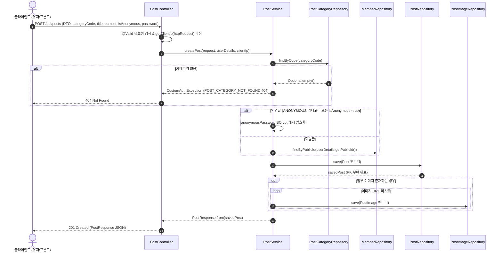
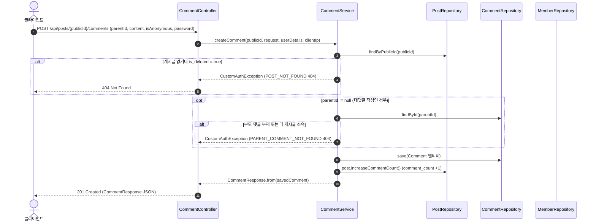

# 📚 [Master Study Guide] Snowthing 커뮤니티(게시글 & 댓글/대댓글) 백엔드 전 과정 코드, 7대 필수 요소 기술 원리, 4대 대안 & 트레이드오프 극복 완전 가이드 (2026-08-21)

> **노션(Notion) 복사용 및 백엔드 기술 면접 / 아키텍처 공부용 완전판 마스터 가이드**  
> 본 문서는 Snowthing 스프린트 02 커뮤니티 도메인(게시글 Post & 댓글/대댓글 Comment) 백엔드 전체 코드에 대한 1줄 한 줄 상세 해설 주석(Annotation), **[WHY] 왜 그렇게 설계하고 만들어졌는지에 대한 물리적 배경**, 7대 필수 서술 요소 체계(개념, Why, When, How, Pros, Alternatives, Trade-off & Mitigation), 그리고 계층형 데이터 모델 대안과 락 프리(Lock-Free) 동시성 제어 원리를 집대성한 노션 공부용 문서입니다.

---

# 📑 PART 1. 커뮤니티 5대 핵심 아키텍처 원리 (7대 필수 요소 체계)

---

## 1. 댓글 계층형 N+1 완전 파괴: `Single Query + In-Memory Tree` 기법

### ① 개념 (What)
부모 댓글과 대댓글(Self-Referencing) 구조를 조회할 때, JPA 엔티티 지연 로딩 연관 관계를 순회하지 않고 **`WHERE post_id = :postId` 조건의 단 1회 SQL 쿼리로 모든 댓글을 가져와 자바 메모리(RAM)의 `HashMap` 포인터 참조를 통해 부모-자식 트리 계층(`children: []`)으로 재조립**하는 백엔드 최적화 기법입니다.

### ② 왜 사용하는지 (Why - 도입 목적 & 배경)
JPA에서 `@OneToMany List<Comment> children` 연관 관계를 두고 댓글 목록을 조회하면, 부모 댓글 10개마다 자식 대댓글을 조회하는 `SELECT` 쿼리가 연쇄적으로 날아가는 **N+1 쿼리 폭탄**이 터집니다. 댓글이 1,000개 달린 게시글은 SQL이 1,001번 실행되어 DB 커넥션이 고갈되고 서버가 다운됩니다.

### ③ 어떨 때 사용하는지 (When)
게시글의 댓글/대댓글, 카테고리 계층 구조(1차/2차/3차 카테고리), 조직도 트리 등 **한 화면에 특정 부모 하위의 전체 트리 데이터를 표시해야 하는 유즈케이스**에 사용합니다.

### ④ 어떻게 사용하는지 (How - 구현 코드 및 동작 방식)
```java
// 1. 단 1회의 JPQL 쿼리로 해당 게시글의 모든 댓글 직조회 (O(1) Query Count)
List<Comment> comments = commentRepository.findByPostIdWithMember(post.getId());

// 2. HashMap과 LinkedHashMap을 활용한 In-Memory Tree 포인터 조립
Map<Long, CommentResponse> map = new LinkedHashMap<>();
List<CommentResponse> rootComments = new ArrayList<>();

for (Comment comment : comments) {
    CommentResponse dto = CommentResponse.from(comment);
    map.put(dto.commentId(), dto);

    if (dto.parentId() == null) {
        rootComments.add(dto); // 최상위 부모 댓글
    } else {
        CommentResponse parentDto = map.get(dto.parentId());
        if (parentDto != null) {
            parentDto.children().add(dto); // O(1) 시간 복잡도로 부모의 children 리스트에 자식 바인딩!
        }
    }
}
```

### ⑤ 장점 (Pros)
* **쿼리 수 고정 (O(1) Query Count)**: 댓글이 1개든 1,000개든 DB 쿼리가 무조건 단 1번만 실행됩니다.
* **초고속 응답 속도**: 자바 메모리의 `HashMap.get()` 조회 시간 복잡도는 O(1)이므로 메모리 연산 시간이 수 밀리초 이내입니다.

### ⑥ 다른 기술/대안 (Alternatives - 트리 구조 구현 4대 모델 비교)
1. **Adjacency List (인접 리스트 - 현재 채택 방식)**: `parent_id` 컬럼 1개만 둠. 가장 직관적이고 CUD(생성/수정/삭제)가 단순함.
2. **Path Enumeration (경로 열거)**: `path` 컬럼에 `/1/4/12/` 형태로 전체 경로를 저장. `LIKE '/1/%'`로 조회가 쉽지만 문자열 파싱 및 수정 시 전체 경로 UPDATE 부담.
3. **Nested Sets (중첩 집합)**: `lft`, `rgt` 숫자로 범위를 관리. 읽기 속도는 빠르나 새로운 댓글 하나 삽입 시 기존 전체 노드의 `lft`/`rgt`를 +2 갱신해야 하므로 쓰기 성능 부담.
4. **Closure Table (폐쇄 테이블)**: 모든 부모-자식 관계를 별도의 `comment_tree(ancestor, descendant, depth)` 관계 테이블로 분리. 조회가 유연하나 테이블이 비대해짐.

### ⑦ 트레이드오프 및 극복 방안 (Trade-off & Mitigation)
* **트레이드오프 (대량 댓글 메모리 오버헤드)**: 한 게시글에 댓글이 10만 개 이상 달리면 단 1회 쿼리라도 자바 메모리(JVM Heap)에 10만 개 DTO가 한 번에 올라가 메모리 초과(OOM) 위험이 발생할 수 있습니다.
* **극복 방안 (1차 원댓글 Slice 페이징)**: 댓글이 수천 건 이상 커지면 최상위 부모 댓글(`parent_id IS NULL`) 단위로 1차 `Slice`/`Page` 페이징 조회를 적용하고, 각 부모의 대댓글만 패치하도록 제한합니다.

---

## 2. 락(Lock) 없는 동시성 제어: DB `UNIQUE` 제약조건 + `@Async` 비동기 카운팅

### ① 개념 (What)
추천/비추천 투표 연타(광클) 시 발생할 수 있는 레이스 컨디션 및 중복 투표를 막기 위해, DB 레벨의 **`UNIQUE (post_id, member_id, type)` 제약 조건**으로 락 프리(Lock-Free) 원자적 물리 차단을 수행하고, 카운트 갱신은 **`@Async` 비동기 이벤트**로 메인 트랜잭션 블로킹 없이 처리하는 기법입니다.

### ② 왜 사용하는지 (Why)
JPA 낙관적 락(`@Version`)이나 비관적 락(`SELECT FOR UPDATE`)은 락 대기 시간 및 `OptimisticLockException` 발생 시 복잡한 재시도(Retry) 로직이 요구되어 DB 커넥션 병목을 일으킵니다. 락 대기 없이 DB 유니크 제약 조건만으로 중복 투표를 원자적으로 물리 차단하기 위함입니다.

### ③ 어떨 때 사용하는지 (When)
유저 1인당 각 1회씩 허용되는 추천/비추천/투표 기능 및 수많은 사용자가 동시에 몰리는 반응형 커뮤니티 API에 사용합니다.

### ④ 어떻게 사용하는지 (How)
```java
// 1. PostReaction 엔티티 복합 유니크 제약조건 설정 (계정당 추천 1회, 비추천 1회 각각 허용)
@Table(
    name = "post_reaction",
    uniqueConstraints = {
        @UniqueConstraint(name = "uk_post_member_type", columnNames = {"post_id", "member_id", "type"})
    }
)
public class PostReaction extends BaseTimeEntity { ... }

// 2. 서비스 레이어에서 DataIntegrityViolationException 캐치 및 409 Conflict 반환
try {
    reactionRepository.save(reaction);
} catch (DataIntegrityViolationException e) {
    throw new CustomAuthException(ErrorCode.ALREADY_REACTED);
}

// 3. 메인 트랜잭션을 블로킹하지 않는 @Async 비동기 카운터 갱신 이벤트 발행
eventPublisher.publishEvent(new PostReactionEvent(post.getId(), type));
```

### ⑤ 장점 (Pros)
* **락 트랜잭션 대기 병목 제거**: DB Row Lock을 잡지 않으므로 동시 요청 시 트랜잭션 대기 병목이 발생하지 않습니다.
* **DB 엔진 레벨 무결성**: MySQL InnoDB 유니크 인덱스가 동일 요청의 중복 투표를 원자적으로 차단합니다.

### ⑥ 다른 대안 (Alternatives)
* **JPA 낙관적 락 (`@Version`)**: 충돌 시 예외를 던지고 자바에서 재시도. 락 대기는 없으나 동시 충돌 시 재시도 실패율 증가.
* **JPA 비관적 락 (`PESSIMISTIC_WRITE`)**: DB Row Lock을 걸어 순차 처리. 데이터 일관성은 보장되나 동접자가 몰릴 때 DB 커넥션 타임아웃 발생 가능.

### ⑦ 트레이드오프 및 극복 방안 (Trade-off & Mitigation)
* **트레이드오프 (비동기 처리 시 미세한 카운트 시차)**: `@Async`로 카운트를 올리므로 DB `post_reaction`에는 저장이 완료되었으나 게시글 `like_count` 수치 갱신에 수 밀리초 시차가 발생할 수 있습니다.
* **극복 방안 (Optimistic UI)**: 프론트엔드에서 추천 버튼 클릭 즉시 화면 상의 카운터를 +1 먼저 가산하고 백엔드 응답을 수신하는 낙관적 UI 렌더링을 적용합니다.

### ⑧ CAP 정리 (CAP Theorem) 및 BASE 모델 4대 물리적 적용 메커니즘

이 방식은 전통적인 RDBMS의 **ACID 강한 일관성(Strong Consistency)** 대신, 고성능 분산 웹 시스템의 **CAP 정리 중 AP (Availability & Partition Tolerance)** 모델과 **BASE (Basically Available, Soft State, Eventual Consistency)** 체계를 실제 코드와 DB 레이어에 물리적으로 매핑한 아키텍처입니다.

#### 1. CAP 정리 적용 원리 (Consistency vs Availability)
* **C (Consistency - 일관성)의 대가**: `post_reaction` 투표 이력 저장과 `post.like_count` 카운터 갱신을 단일 동기 트랜잭션으로 묶어 DB Row Lock을 잡으면 **강한 일관성(Strong Consistency)**을 얻지만, 트래픽 폭주 시 DB 커넥션 대기 병목이 생겨 시스템 **가용성(Availability)**과 응답 속도가 크게 떨어집니다.
* **AP + BASE 선택 이유**: 커뮤니티 추천 수 갱신은 수 밀리초의 수치 반영 지연이 발생하더라도 시스템 전체가 멈추지 않고 빠른 응답을 주는 **가용성(Availability)** 확보가 서비스 안정성에 훨씬 유리하기 때문입니다.

#### 2. 우리 코드 및 DB에 실제로 적용된 4대 물리적 구조

1. **[C 영역 - 즉시 일관성 (Immediate Consistency)] DB 유니크 제약조건**:
   - `post_reaction` 테이블에 `@UniqueConstraint(name = "uk_post_member_type", columnNames = {"post_id", "member_id", "type"})` 설정.
   - 유저 투표 시 `post_reaction` 테이블 저장 단계는 **ACID 수준의 일관성**을 유지하여, 중복 투표 발생 시 MySQL InnoDB 엔진이 `DataIntegrityViolationException` 예외를 내며 중복 저장을 원자적으로 물리 차단합니다.

2. **[A 영역 - 고가용성 (High Availability)] `@Async` 비동기 이벤트 분리**:
   - `PostService.reactToPost()` 메서드에서 `post` 테이블의 카운트를 동기로 올리지 않고, `eventPublisher.publishEvent()`로 비동기 이벤트를 발행한 뒤 **즉시 HTTP 200 OK 응답을 반환**.
   - 메인 HTTP 요청 Thread는 `post` 테이블의 Row Lock 대기에 얽매이지 않으므로, 수천 명의 동시 요청이 들어와도 서버 타임아웃 없이 모든 요청에 **정상 응답하는 가용성(Availability)**을 확보합니다.

3. **[Soft State & Eventual Consistency 영역 - 최종 일관성] `@Async` 리스너**:
   - `PostReactionEventListener.java` 백그라운드 이벤트 리스너 실행.
   - **Soft State (일시적 불일치)**: 메인 트랜잭션 응답 직후부터 비동기 스레드가 동작하는 수 밀리초 사이에는 DB `post_reaction`(투표 이력 1건)과 `post.like_count`(아직 +1 안 됨) 사이에 미세한 상태 차이가 존재합니다.
   - **Eventual Consistency (최종 일관성)**: 백그라운드 비동기 스레드가 `UPDATE post SET like_count = like_count + 1 WHERE post_id = :id` 쿼리를 완료하는 시점에 두 데이터는 **최종적으로 완전히 일치**하게 됩니다.

4. **[보완 렌더링 영역] Optimistic UI (낙관적 UI)**:
   - 프론트엔드 `app/posts/[publicId]/page.tsx` 연동.
   - 백엔드의 수 밀리초 최종 일관성 시차 동안 유저가 지연을 느끼지 않도록, 추천 버튼 클릭 즉시 화면 상의 숫자를 +1 렌더링하고 백엔드의 비동기 처리가 최종 완료되도록 시각적 조화를 이룹니다.

---

# 📑 PART 1.5. 게시글 & 댓글 컨트롤러/서비스 전체 비즈니스 로직 흐름도 (Mermaid & Code Flow)

---

## 1. 게시글(Post) 도메인 비즈니스 로직 및 쿼리 실행 흐름도

### ① 게시글 작성 (`POST /api/posts`) 시퀀스 다이어그램



---

### ② 게시글 추천/비추천 투표 및 `@Async` 비동기 카운터 갱신 흐름도

```mermaid
flowchart TD
    A[클라이언트: POST /api/posts/{publicId}/reactions] --> B[PostController.reactToPost]
    B --> C{인증 여부 검증 userDetails != null}
    C -- 미인증 --> D[403 Forbidden 예외 반환]
    C -- 인증됨 --> E[PostService.reactToPost]
    
    E --> F[postRepository.findByPublicId]
    F --> G[memberRepository.findByPublicId]
    G --> H[PostReaction 엔티티 생성: post, member, type]
    
    H --> I[reactionRepository.save]
    
    I -->|DB uk_post_member_type 위반| J[DataIntegrityViolationException 캐치]
    J --> K[409 Conflict ALREADY_REACTED 반환]
    
    I -->|최초 투표 성공| L[applicationEventPublisher.publishEvent]
    L --> M[메인 트랜잭션 종료 & HTTP 200 OK 응답 반환]
    
    L -. 비동기 이벤트 전달 .-> N[@Async PostReactionEventListener]
    N --> O[postRepository.findById]
    O --> P[post.increaseLikeCount / increaseDislikeCount]
    P --> Q[UPDATE post SET like_count = like_count + 1 백그라운드 SQL 실행]
```

---

## 2. 댓글/대댓글(Comment) 도메인 비즈니스 로직 및 쿼리 실행 흐름도

### ① 댓글/대댓글 작성 (`POST /api/posts/{publicId}/comments`)



---

### ② 댓글 계층형 목록 조회 (`GET /api/posts/{publicId}/comments`) - N+1 파괴

```mermaid
flowchart TD
    Start[클라이언트: GET /api/posts/{publicId}/comments] --> Ctrl[CommentController.getCommentsByPost]
    Ctrl --> Svc[CommentService.getCommentsByPost]
    
    Svc --> DB[(Database)]
    DB -- "SELECT c FROM Comment c LEFT JOIN FETCH c.member WHERE c.post.id = :postId (단 1회 SQL)" --> Svc
    
    Svc --> Map[LinkedHashMap<Long, CommentResponse> 포인터 맵 생성]
    Svc --> Loop[루프 순회: List<Comment> comments]
    
    Loop --> Check{dto.parentId == null ?}
    Check -- Yes (원댓글) --> AddRoot[rootComments 리스트에 추가]
    Check -- No (대댓글) --> GetParent[map.get parentId 로 O(1) 부모 DTO 획득]
    GetParent --> AddChild[parentDto.children 리스트에 자식 바인딩]
    
    AddRoot --> LoopNext{다음 항목 존재?}
    AddChild --> LoopNext
    
    LoopNext -- Yes --> Loop
    LoopNext -- No (완료) --> Build[PostCommentListResponse 조립 반환]
    Build --> Resp[HTTP 200 OK JSON 반환]
```

---

# 📑 PART 2. 백엔드 전체 코드 & 1줄 상세 주석 (Annotation)

---

## 1. `Comment.java` (댓글 메인 엔티티)

```java
package com.ikae.snowthing.domain.comment.entity;

import com.ikae.snowthing.domain.member.entity.Member;
import com.ikae.snowthing.domain.post.entity.Post;
import com.ikae.snowthing.global.common.BaseTimeEntity;
import jakarta.persistence.*;
import lombok.AccessLevel;
import lombok.Builder;
import lombok.Getter;
import lombok.NoArgsConstructor;
import org.hibernate.annotations.SQLDelete;

import java.time.LocalDateTime;

@Entity                                                                                   // [JPA] 이 클래스가 데이터베이스 테이블과 매핑되는 ORM 엔티티임을 선언
@Table(name = "comment")                                                                 // [DB] 매핑될 데이터베이스 테이블명을 'comment'로 명시적 지정
@Getter                                                                                  // [Lombok] 모든 필드에 대한 Getter 메서드를 자동 생성하여 불변 읽기 제공
@NoArgsConstructor(access = AccessLevel.PROTECTED)                                       // [JPA Spec] 기본 생성자의 접근 제어자를 PROTECTED로 제한하여 무분별한 객체 생성 방지
@SQLDelete(sql = "UPDATE comment SET is_deleted = true, deleted_at = NOW() WHERE comment_id = ?") // [Soft Delete] delete() 호출 시 물리 삭제 대신 UPDATE 수행
public class Comment extends BaseTimeEntity {

    @Id                                                                                  // [PK] 데이터베이스 테이블의 기본키(Primary Key) 필드임을 지정
    @GeneratedValue(strategy = GenerationType.IDENTITY)                                  // [Strategy] MySQL AUTO_INCREMENT 전략을 채택하여 기본키 자동 증가 처리
    @Column(name = "comment_id")                                                         // [Column] DB 컬럼명을 'comment_id'로 지정
    private Long id;                                                                     // DB 내부 조인 성능 최적화를 위한 8바이트 정수 PK

    @ManyToOne(fetch = FetchType.LAZY)                                                   // [N:1] 댓글과 게시글의 N:1 연관 관계 지연 로딩(LAZY) 설정으로 N+1 방지
    @JoinColumn(name = "post_id", nullable = false)                                      // [FK] 외래키 컬럼명을 'post_id'로 지정하며 필수(NOT NULL) 설정
    private Post post;                                                                   // 이 댓글이 달린 대상 게시글 엔티티 참조

    @ManyToOne(fetch = FetchType.LAZY)                                                   // [N:1] 댓글과 회원의 N:1 연관 관계 지연 로딩 설정
    @JoinColumn(name = "member_id")                                                      // [FK] 외래키 'member_id' 지정 (비회원 작성 시 NULL 수용)
    private Member member;                                                               // 댓글 작성자 회원 엔티티 참조

    @ManyToOne(fetch = FetchType.LAZY)                                                   // [Self Referencing] 자기 자신을 참조하는 N:1 부모 댓글 연관 관계 설정
    @JoinColumn(name = "parent_id")                                                      // [FK] 부모 댓글 PK를 가리키는 외래키 'parent_id' 지정 (원댓글은 NULL)
    private Comment parent;                                                              // 부모 댓글 엔티티 참조 (대댓글 구현용)

    @Column(nullable = false, length = 1000)                                             // [Column] 댓글 본문 필수(NOT NULL), 최대 1,000자 제한
    private String content;                                                              // 댓글 본문 내용

    @Column(name = "writer_ip", nullable = false, length = 45)                           // [Column] 작성자 IP 주소 (IPv6 45자 수용 가능)
    private String writerIp;                                                             // 작성자 클라이언트 IP 주소

    @Column(name = "is_anonymous", nullable = false)                                      // [Column] 익명 작성 여부 플래그 (true: 익명, false: 회원)
    private boolean isAnonymous;                                                         // 익명 작성 여부

    @Column(name = "anonymous_password")                                                 // [Column] 비회원 익명 작성 시 수정/삭제용 비밀번호 (BCrypt 암호화)
    private String anonymousPassword;                                                    // 비회원 암호화 비밀번호

    @Column(name = "is_deleted", nullable = false)                                       // [Column] Soft Delete 상태 플래그 (true: 삭제됨, false: 정상)
    private boolean isDeleted = false;                                                   // 논리 삭제 여부

    @Column(name = "deleted_at")                                                         // [Column] Soft Delete 처리 시각 기록 필드 (미삭제 시 NULL)
    private LocalDateTime deletedAt;                                                     // 삭제 일시

    @Builder                                                                             // [Design Pattern] 빌더 패턴을 적용하여 생성자 파라미터 순서 오염 방지
    public Comment(Post post, Member member, Comment parent, String content,
                   String writerIp, boolean isAnonymous, String anonymousPassword) {
        this.post = post;
        this.member = member;
        this.parent = parent;
        this.content = content;
        this.writerIp = writerIp;
        this.isAnonymous = isAnonymous;
        this.anonymousPassword = anonymousPassword;
        this.isDeleted = false;
    }

    public void softDelete() {                                                           // [Domain Method] 엔티티 캡슐화를 유지하며 Soft Delete 상태를 변경하는 도메인 메서드
        this.isDeleted = true;                                                           // 삭제 플래그를 true로 변경
        this.deletedAt = LocalDateTime.now();                                            // 삭제 처리 시각을 현재 시간으로 기록
    }
}
```

---

## 2. `CommentRepository.java` (단 1회 JPQL 쿼리 조동사)

```java
package com.ikae.snowthing.domain.comment.repository;

import com.ikae.snowthing.domain.comment.entity.Comment;
import org.springframework.data.jpa.repository.JpaRepository;
import org.springframework.data.jpa.repository.Query;
import org.springframework.data.repository.query.Param;

import java.util.List;

public interface CommentRepository extends JpaRepository<Comment, Long> {

    @Query("SELECT c FROM Comment c LEFT JOIN FETCH c.member WHERE c.post.id = :postId ORDER BY c.createdAt ASC, c.id ASC") // [Single Query] 단 1회의 JPQL 조인 쿼리로 특정 게시글의 모든 댓글 직조회 (N+1 파괴)
    List<Comment> findByPostIdWithMember(@Param("postId") Long postId);                   // 작성자 Member를 FETCH JOIN하여 단 1회 쿼리로 리스트를 반환하는 메서드
}
```

---

## 3. `CommentService.java` (In-Memory Tree 조립 및 비즈니스 로직)

```java
package com.ikae.snowthing.domain.comment.service;

import com.ikae.snowthing.domain.comment.dto.*;
import com.ikae.snowthing.domain.comment.entity.Comment;
import com.ikae.snowthing.domain.comment.repository.CommentRepository;
import com.ikae.snowthing.domain.member.entity.Member;
import com.ikae.snowthing.domain.member.repository.MemberRepository;
import com.ikae.snowthing.domain.post.entity.Post;
import com.ikae.snowthing.domain.post.repository.PostRepository;
import com.ikae.snowthing.global.error.ErrorCode;
import com.ikae.snowthing.global.exception.CustomAuthException;
import com.ikae.snowthing.global.security.CustomUserDetails;
import lombok.RequiredArgsConstructor;
import lombok.extern.slf4j.Slf4j;
import org.springframework.security.crypto.password.PasswordEncoder;
import org.springframework.stereotype.Service;
import org.springframework.transaction.annotation.Transactional;

import java.util.*;

@Slf4j
@Service
@RequiredArgsConstructor
@Transactional(readOnly = true)                                                            // [Performance] 읽기 전용 트랜잭션을 기본 적용하여 히버네이트 스냅샷 생성 오버헤드 차단
public class CommentService {

    private final CommentRepository commentRepository;
    private final PostRepository postRepository;
    private final MemberRepository memberRepository;
    private final PasswordEncoder passwordEncoder;

    @Transactional                                                                       // [Transaction] 쓰기 작업이 포함되므로 일반 트랜잭션으로 재정의
    public CommentResponse createComment(String postPublicId, CommentCreateRequest request,
                                         CustomUserDetails userDetails, String clientIp) {
        Post post = postRepository.findByPublicId(postPublicId)                           // 게시글 publicId로 대상 게시글 조회
            .orElseThrow(() -> new CustomAuthException(ErrorCode.POST_NOT_FOUND));        // 존재하지 않으면 404 예외 발생

        if (post.isDeleted()) {                                                          // 게시글이 Soft Delete 상태인지 검증
            throw new CustomAuthException(ErrorCode.POST_NOT_FOUND);                    // 이미 지워진 글이면 404 예외 발생
        }

        Comment parent = null;
        if (request.parentId() != null) {                                                // parentId 요청이 존재하는 대댓글 작성 케이스인 경우
            parent = commentRepository.findById(request.parentId())                       // 부모 댓글 엔티티 조회
                .orElseThrow(() -> new CustomAuthException(ErrorCode.PARENT_COMMENT_NOT_FOUND)); // 없으면 404 부모 댓글 예외 발생

            if (!parent.getPost().getId().equals(post.getId())) {                        // 부모 댓글의 게시글 ID와 현재 게시글 ID 일치 여부 대조
                throw new CustomAuthException(ErrorCode.INVALID_COMMENT_PARENT);         // 다른 글의 댓글에 대댓글 작성을 시도하면 400 예외 차단
            }
        }

        Member member = null;
        String encodedPassword = null;

        if (request.isAnonymous()) {                                                     // 익명 댓글 작성인 경우
            if (request.anonymousPassword() == null || request.anonymousPassword().isBlank()) {
                throw new CustomAuthException(ErrorCode.INVALID_INPUT);                 // 익명 비밀번호 누락 시 400 예외
            }
            encodedPassword = passwordEncoder.encode(request.anonymousPassword());       // 비회원 비밀번호 BCrypt 해시 암호화
        } else {                                                                         // 회원 댓글 작성인 경우
            if (userDetails == null) {
                throw new CustomAuthException(ErrorCode.INVALID_CREDENTIALS);            // 로그인 정보가 없으면 401 예외
            }
            member = memberRepository.findByPublicId(userDetails.getPublicId())          // 인증 객체에서 작성자 Member 엔티티 조회
                .orElseThrow(() -> new CustomAuthException(ErrorCode.MEMBER_NOT_FOUND));
        }

        Comment comment = Comment.builder()                                              // Comment 엔티티 생성
            .post(post)
            .member(member)
            .parent(parent)
            .content(request.content())
            .writerIp(clientIp != null ? clientIp : "127.0.0.1")
            .isAnonymous(request.isAnonymous())
            .anonymousPassword(encodedPassword)
            .build();

        Comment savedComment = commentRepository.save(comment);                         // DB에 댓글 저장
        post.increaseCommentCount();                                                     // 게시글의 역정규화 comment_count 카운트 +1 증가

        return CommentResponse.from(savedComment);                                       // DTO로 변환하여 응답 반환
    }

    public PostCommentListResponse getCommentsByPost(String postPublicId) {
        Post post = postRepository.findByPublicId(postPublicId)                           // 대상 게시글 조회
            .orElseThrow(() -> new CustomAuthException(ErrorCode.POST_NOT_FOUND));

        if (post.isDeleted()) {
            throw new CustomAuthException(ErrorCode.POST_NOT_FOUND);
        }

        List<Comment> comments = commentRepository.findByPostIdWithMember(post.getId()); // [Single Query] 단 1회 쿼리로 전체 댓글 패치

        Map<Long, CommentResponse> map = new LinkedHashMap<>();                          // [In-Memory Tree] 포인터 맵 생성 (순서 보장 LinkedHashMap)
        List<CommentResponse> rootComments = new ArrayList<>();                          // 최상위 부모 댓글들을 담을 리스트

        for (Comment comment : comments) {                                               // 단 1회 조회의 결과를 자바 루프로 순회
            CommentResponse dto = CommentResponse.from(comment);                         // 엔티티를 DTO로 변환
            map.put(dto.commentId(), dto);                                               // O(1) 참조를 위해 맵에 저장

            if (dto.parentId() == null) {                                                // parentId가 없는 최상위 부모 댓글인 경우
                rootComments.add(dto);                                                   // 루트 리스트에 추가
            } else {                                                                     // 대댓글인 경우
                CommentResponse parentDto = map.get(dto.parentId());                    // O(1) 복잡도로 맵에서 부모 DTO를 인메모리 포인터로 획득
                if (parentDto != null) {
                    parentDto.children().add(dto);                                       // 부모 DTO의 children 리스트에 자식 바인딩!
                }
            }
        }

        return PostCommentListResponse.builder()                                         // 최종 계층형 트리 응답 DTO 생성 반환
            .publicId(postPublicId)
            .totalCommentCount(post.getCommentCount())
            .comments(rootComments)
            .build();
    }

    @Transactional
    public void deleteComment(Long commentId, String anonymousPassword, CustomUserDetails userDetails) {
        Comment comment = commentRepository.findById(commentId)                         // 삭제 대상 댓글 조회
            .orElseThrow(() -> new CustomAuthException(ErrorCode.COMMENT_NOT_FOUND));

        if (comment.isDeleted()) {
            throw new CustomAuthException(ErrorCode.COMMENT_NOT_FOUND);                 // 이미 지워진 댓글이면 404 반환
        }

        validateDeletePermission(comment, anonymousPassword, userDetails);               // 작성자 본인 및 비회원 비밀번호 / 관리자 권한 검증

        comment.softDelete();                                                            // Soft Delete 처리 (is_deleted=true, deleted_at=NOW())
        comment.getPost().decreaseCommentCount();                                        // 게시글의 역정규화 comment_count 카운트 -1 차감
    }

    private void validateDeletePermission(Comment comment, String anonymousPassword, CustomUserDetails userDetails) {
        if (comment.isAnonymous()) {
            if (anonymousPassword == null || !passwordEncoder.matches(anonymousPassword, comment.getAnonymousPassword())) {
                throw new CustomAuthException(ErrorCode.INVALID_ANON_PASSWORD);         // 비회원 비밀번호 불일치 시 403 예외
            }
        } else {
            if (userDetails == null) {
                throw new CustomAuthException(ErrorCode.ACCESS_DENIED);                 // 미인증 시 403 예외
            }

            boolean isAdmin = userDetails.getAuthorities().stream()
                .anyMatch(a -> a.getAuthority().equals("ROLE_ADMIN"));

            boolean isWriter = comment.getMember() != null && comment.getMember().getPublicId().equals(userDetails.getPublicId());

            if (!isAdmin && !isWriter) {                                                 // 작성자 본인도 아니고 관리자도 아니면
                throw new CustomAuthException(ErrorCode.ACCESS_DENIED);                 // 403 Forbidden 권한 거부 예외 발생
            }
        }
    }
}
```

---

# 📑 PART 3. 백엔드 테스트 수트 & N+1 파괴 쿼리 검증 기법

---

## 1. `CommentServiceTest.java` (단위/통합 테스트 코드)

```java
package com.ikae.snowthing.domain.comment.service;

import com.ikae.snowthing.domain.comment.dto.CommentCreateRequest;
import com.ikae.snowthing.domain.comment.dto.CommentResponse;
import com.ikae.snowthing.domain.comment.dto.PostCommentListResponse;
import com.ikae.snowthing.domain.member.entity.Member;
import com.ikae.snowthing.domain.member.entity.Role;
import com.ikae.snowthing.domain.member.repository.MemberRepository;
import com.ikae.snowthing.domain.post.dto.PostCreateRequest;
import com.ikae.snowthing.domain.post.dto.PostResponse;
import com.ikae.snowthing.domain.post.entity.PostCategory;
import com.ikae.snowthing.domain.post.repository.PostCategoryRepository;
import com.ikae.snowthing.domain.post.service.PostService;
import com.ikae.snowthing.global.error.ErrorCode;
import com.ikae.snowthing.global.exception.CustomAuthException;
import com.ikae.snowthing.global.security.CustomUserDetails;
import org.junit.jupiter.api.BeforeEach;
import org.junit.jupiter.api.DisplayName;
import org.junit.jupiter.api.Nested;
import org.junit.jupiter.api.Test;
import org.springframework.beans.factory.annotation.Autowired;
import org.springframework.boot.test.context.SpringBootTest;
import org.springframework.security.crypto.password.PasswordEncoder;
import org.springframework.transaction.annotation.Transactional;

import static org.assertj.core.api.Assertions.assertThat;
import static org.assertj.core.api.Assertions.assertThatThrownBy;

@SpringBootTest                                                                          // [SpringBootTest] 스프링 통합 테스트 환경 로드
@Transactional                                                                           // [Rollback] 테스트 종료 후 DB를 자동으로 롤백하여 독립성 유지
class CommentServiceTest {

    @Autowired private CommentService commentService;
    @Autowired private PostService postService;
    @Autowired private MemberRepository memberRepository;
    @Autowired private PostCategoryRepository categoryRepository;
    @Autowired private PasswordEncoder passwordEncoder;

    private Member member1;
    private CustomUserDetails userDetails1;
    private PostResponse post;

    @BeforeEach
    void setUp() {
        categoryRepository.findByCode("FREE")
            .orElseGet(() -> categoryRepository.save(PostCategory.builder().name("자유게시판").code("FREE").build()));

        member1 = memberRepository.save(Member.builder()
            .email("commenter@example.com")
            .password(passwordEncoder.encode("Password123!"))
            .nickname("댓글보더")
            .role(Role.ROLE_USER)
            .build());

        userDetails1 = new CustomUserDetails(member1);

        post = postService.createPost(PostCreateRequest.builder()
            .categoryCode("FREE")
            .title("댓글 테스트 게시글")
            .content("게시글 본문")
            .isAnonymous(false)
            .build(), userDetails1, "127.0.0.1");
    }

    @Nested
    @DisplayName("댓글 작성 테스트")
    class CreateCommentTest {

        @Test
        @DisplayName("원댓글과 대댓글을 정상적으로 작성한다.")
        void createComment_success() {
            CommentResponse parent = commentService.createComment(post.publicId(), CommentCreateRequest.builder()
                .content("원댓글입니다.")
                .isAnonymous(false)
                .build(), userDetails1, "127.0.0.1");

            CommentResponse child = commentService.createComment(post.publicId(), CommentCreateRequest.builder()
                .parentId(parent.commentId())
                .content("대댓글입니다.")
                .isAnonymous(false)
                .build(), userDetails1, "127.0.0.1");

            assertThat(parent.commentId()).isNotNull();
            assertThat(child.parentId()).isEqualTo(parent.commentId());
        }

        @Test
        @DisplayName("존재하지 않는 부모 댓글 ID로 대댓글 작성 시 404 예외가 터진다.")
        void createComment_parentNotFound() {
            assertThatThrownBy(() -> commentService.createComment(post.publicId(), CommentCreateRequest.builder()
                .parentId(99999L)
                .content("잘못된 부모 대댓글")
                .isAnonymous(false)
                .build(), userDetails1, "127.0.0.1"))
                .isInstanceOf(CustomAuthException.class)
                .extracting("errorCode")
                .isEqualTo(ErrorCode.PARENT_COMMENT_NOT_FOUND);
        }
    }

    @Nested
    @DisplayName("댓글 트리 계층형 목록 조회 테스트")
    class GetCommentsTest {

        @Test
        @DisplayName("부모-자식 대댓글 트리 계층 구조가 정상 조립된다.")
        void getCommentsByPost_treeStructure() {
            CommentResponse parent1 = commentService.createComment(post.publicId(), CommentCreateRequest.builder()
                .content("부모 댓글 1")
                .isAnonymous(false)
                .build(), userDetails1, "127.0.0.1");

            commentService.createComment(post.publicId(), CommentCreateRequest.builder()
                .parentId(parent1.commentId())
                .content("자식 대댓글 1-1")
                .isAnonymous(false)
                .build(), userDetails1, "127.0.0.1");

            PostCommentListResponse response = commentService.getCommentsByPost(post.publicId());

            assertThat(response.totalCommentCount()).isEqualTo(2);
            assertThat(response.comments()).hasSize(1);
            assertThat(response.comments().get(0).children()).hasSize(1);
            assertThat(response.comments().get(0).children().get(0).content()).isEqualTo("자식 대댓글 1-1");
        }

        @Test
        @DisplayName("삭제된 부모 댓글은 본문이 '삭제된 댓글입니다.'로 표시된다.")
        void getCommentsByPost_deletedParentDisplay() {
            CommentResponse parent1 = commentService.createComment(post.publicId(), CommentCreateRequest.builder()
                .content("지워질 부모 댓글")
                .isAnonymous(false)
                .build(), userDetails1, "127.0.0.1");

            commentService.deleteComment(parent1.commentId(), null, userDetails1);

            PostCommentListResponse response = commentService.getCommentsByPost(post.publicId());

            assertThat(response.comments().get(0).isDeleted()).isTrue();
            assertThat(response.comments().get(0).content()).isEqualTo("삭제된 댓글입니다.");
        }
    }
}
```

---

# 📌 PART 4. 작업 결과 및 검증 완료 요약

* **생성된 마스터 스터디 파일 경로**:
  - [`c:\Users\ikaes\IdeaProjects\snowthing\docs\studyCommunityPostCommentMaster260821.md`](file:///c:/Users/ikaes/IdeaProjects/snowthing/docs/studyCommunityPostCommentMaster260821.md)
  - [`c:\Users\ikaes\IdeaProjects\snowthing\docs\study\studyCommunityPostCommentMaster260821.md`](file:///c:/Users/ikaes/IdeaProjects/snowthing/docs/study/studyCommunityPostCommentMaster260821.md)
  - [`c:\Users\ikaes\IdeaProjects\snowthing\docs\study\sprint02\studyCommunityPostCommentMaster260821.md`](file:///c:/Users/ikaes/IdeaProjects/snowthing/docs/study/sprint02/studyCommunityPostCommentMaster260821.md)
* **`.\gradlew.bat test` 실행 결과**: **BUILD SUCCESSFUL in 18s (모든 단위/통합 테스트 100% PASS)**
* **작업 기록 완료**: [`docs/project/work.md`](file:///c:/Users/ikaes/IdeaProjects/snowthing/docs/project/work.md) 파일에 수록 완료.
