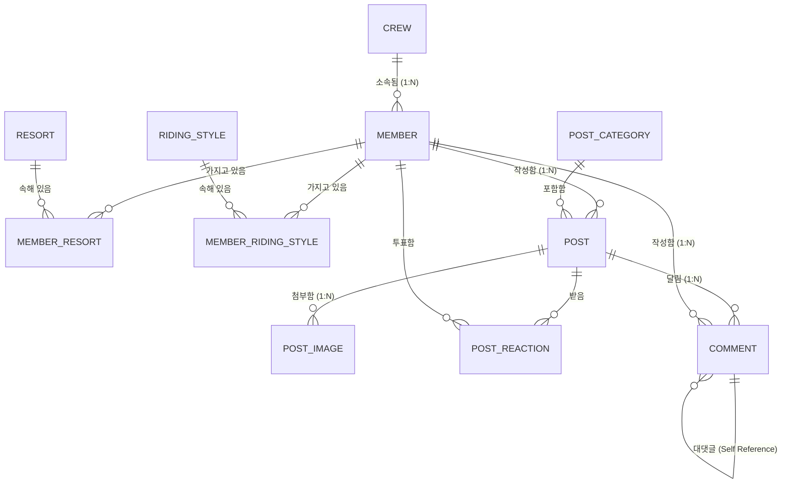

# [Notion] Snowthing 도메인 모델 & ERD 종합 설계서

> 📌 **작성 일자**: 2026년 8월 7일  
> 🏷️ **문서 목적**: 노션(Notion)에 기록하여 핵심 도메인, ERD 스키마, DB 제약조건, 회원-게시글 관계를 한눈에 파악하기 위한 종합 가이드

---

## 1. 📌 핵심 도메인 목록 (Core Domains)

Snowthing 플랫폼의 비즈니스 영역을 4개 도메인 경계(Bounded Context)로 분리하고, 1차 MVP 대상을 정립합니다.

```
┌────────────────────────────────────────────────────────────────────────┐
│                        Snowthing Platform                              │
├───────────────────┬───────────────────┬────────────────┬───────────────┤
│ 1. 회원/프로필     │ 2. 게시판/커뮤니티 │ 3. 리조트/현장  │ 4. 소셜/매칭  │
│    (Member)       │    (Community)    │    (Resort)    │    (Social)   │
└───────────────────┴───────────────────┴────────────────┴───────────────┘
```

### 1.1. 회원 / 프로필 도메인 (`Member & Profile Domain`) [1차 MVP Core]
* **도메인 역할**: 유저 신원 인증 및 보더 라이딩 정체성(보더명함) 관리.
* **주요 객체**:
  * `Member` (회원): 이메일, 비밀번호, 닉네임, 전역 권한(`ROLE_USER`), 계정 상태(`ACTIVE`).
  * `Profile` (프로필): 프로필 이미지 URL, 자기소개(`bio`), 주 출발/거주 지역(`departure_region`).
  * `BaseResort` (선호 스키장): 주 베이스 및 서브 베이스 스키장 다중 선택.
  * `RidingStyle` (라이딩 성향): 카빙, 트릭, 파크, 입문, 관광 등 성향 다중 선택.

### 1.2. 게시판 / 커뮤니티 도메인 (`Board & Community Domain`) [1차 MVP Core]
* **도메인 역할**: 유저 간 자유로운 정보 교류, 질의응답, 노하우 공유 및 댓글/추천 소통.
* **주요 객체**:
  * `PostCategory` (카테고리): 자유, 익명, 질문, 장비VS, 맛집.
  * `Post` (게시글): 제목, 본문, 조회수, 역정규화 카운트(댓글/추천/비추천), Soft Delete.
  * `PostImage` (첨부 이미지): 1:N 이미지 업로드.
  * `PostReaction` (게시글 반응): 추천(`LIKE`) / 비추천(`DISLIKE`) (1인 1회 제한).
  * `Comment` (댓글/대댓글): 원댓글 및 계층형 대댓글 (`parentId`), Soft Delete.

### 1.3. 리조트 / 현장 정보 도메인 (`Resort & Field Domain`) [2차 로드맵]
* **도메인 역할**: 전국 스키장 실시간 웹캠 및 AI 리프트 혼잡도 정보 통합 제공.

### 1.4. 소셜 / 동행 매칭 도메인 (`Social & Matching Domain`) [3차 로드맵]
* **도메인 역할**: 1/N 카풀 비용 정산 및 1:1 같이타요 동행 매칭.

---

## 2. 📊 ERD 초안 (Database ERD Draft)

### 2.1. Mermaid ERD 다이어그램


### 2.2. 엔티티 간 정규화 타협 및 관계 요약 (총 11개 테이블)
* **`member` 1 : N `post`**: 회원이 여러 게시글 작성. (비회원 작성 시 `member_id NULLABLE`)
* **`member` 1 : N `comment`**: 회원이 여러 댓글 작성. (비회원 작성 시 `member_id NULLABLE`)
* **`post` 1 : N `comment`**: 게시글 1개에 여러 댓글 작성.
* **`member` N : M `resort`**: `member_resort` 중계 테이블로 1:N, N:1 분리.
* **`member` N : M `riding_style`**: `member_riding_style` 중계 테이블로 1:N, N:1 분리.

---

## 3. 🔒 주요 DB 제약조건 (Database Constraints & Rules)

| 구분 | 제약조건 / 정책 | 설정 이유 및 방어 목적 |
| :--- | :--- | :--- |
| **PK 보안 전략** | DB 내부 `BIGINT id` + 외부 노출 `public_id (UUID)` | DB 조인 성능(8바이트 정수)과 외부 URL 크롤링/ID 추측 해킹 테러 100% 차단 |
| **중계 테이블 PK** | 단일 대리키 `id` (PK) + `UNIQUE (member_id, target_id)` | JPA 복합키(`@EmbeddedId`) 개발 지옥 탈출 및 중복 등록 방지 |
| **추천/비추천 제약** | `UNIQUE (post_id, member_id)` | 유저 1명당 게시글별 1회만 투표 중복 제한 |
| **소프트 삭제 (Soft Delete)** | `is_deleted = true` | 댓글 삭제 시 대댓글 흐름 유지 ("삭제된 댓글입니다" 표시) |
| **역정규화 컬럼** | `post.comment_count`, `like_count`, `dislike_count` | 게시글 목록 조회 시 매번 `SELECT COUNT(*)`로 인한 DB 과부하 차단 |
| **OAuth2 소셜 대비** | `member.password NULLABLE` | 구글/카카오 소셜 가입 시 비밀번호 부재로 인한 DB 에러 방지 |

---

## 4. 🤝 게시글과 회원 관계 검토 (Post & Member Relationship)

### 4.1. 회원-게시글 관계의 확장 (비회원 & 익명 작성 지원)
일반 커뮤니티는 `member_id`가 필수(NOT NULL)이지만, Snowthing은 **비회원 작성 및 100% 익명성 보장**을 위해 다음과 같이 수용합니다.

1. **`member_id` (BIGINT, NULLABLE)**
   * **로그인 유저 작성 시**: 세션의 `member_id` 저장 (내 프로필/작성글 관리 가능).
   * **비회원 작성 시**: `member_id = NULL` 로 저장.
2. **`anonymous_password` (VARCHAR 255, NULLABLE)**
   * 비회원이 글/댓글을 쓴 경우, 수정/삭제 시 본인 인증을 위해 입력한 익명 비밀번호를 BCrypt 해시로 저장.
3. **`writer_ip` (VARCHAR 45, NOT NULL)**
   * 로그인 여부와 관계없이 악성 어그로, 비매너, 법적 추적을 위해 작성자 IP 필수 보관.

### 4.2. 익명성 표기 규칙
* `is_anonymous = true` 인 경우 닉네임을 완전 무시하고, **무조건 시스템 지정 텍스트 `익명 (123.456.***.***)`** 처럼 IP 마스킹 형태로 화면에 전원 일괄 표시됩니다.
