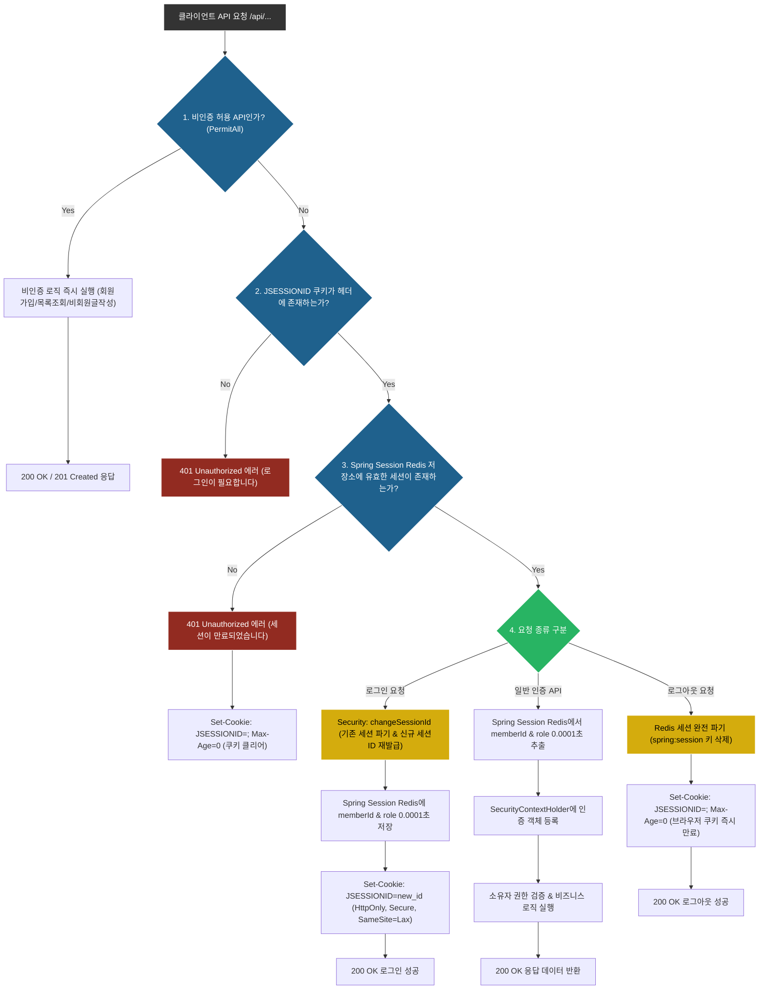

# [Notion] 세션 인증 순서도 (Session Authentication Flowchart)

> 📌 **작성 일자**: 2026년 8월 10일 (최종 수정: 2026년 8월 12일)  
> 🏷️ **문서 목적**: 마크다운(Markdown) 및 노션(Notion) 환경에서 100% 정상 visual 다이어그램으로 렌더링되는 **Spring Session Redis** 기반 세션 인증 순서도

---

## 📊 1. 세션 인증 전체 플로우차트 (Flowchart TD)

Below is the Mermaid flowchart rendered directly in GitHub Markdown and Notion.

---

## 🔍 2. 플로우차트 단계별 조건 분기 설명

### 1단계: API 접근 권한 판별 (`PermitAll` vs `Authenticated`)
* `/api/members` (회원가입), `/api/auth/login` (로그인), `/api/posts` (목록/상세 조회) 같은 **비인증 공개 API는 쿠키 검증을 스킵하고 즉시 실행**됩니다.

### 2단계 & 3단계: 2중 세션 쿠키 검증 (`JSESSIONID` + Spring Session Redis)
* **1차 검증 (브라우저 쿠키)**: 요청 헤더에 `JSESSIONID` 쿠키가 아예 없으면 즉시 `401 Unauthorized`를 반환합니다.
* **2차 검증 (Spring Session Redis RAM)**: 쿠키가 있더라도 Redis 세션 저장소(`spring:session:sessions:...`)에서 만료되거나 삭제되었으면 `401 Unauthorized` 반환과 함께 브라우저 쿠키를 만료(`Max-Age=0`)시킵니다.

### 4단계: 요청 종류별 세션 락 & 처리 메커니즘
1. **로그인 시 (Session Fixation 방어)**:
   * 기존 임시 세션 ID를 파기하고 신규 세션 ID를 발급하는 `request.changeSessionId()`를 호출하여 세션 탈취 공격을 방어합니다.
   * `Set-Cookie: JSESSIONID=...; Path=/api; HttpOnly; Secure; SameSite=Lax` 쿠키를 내려줍니다.
2. **일반 인증 API 요청 시**:
   * Redis에서 0.0001초 만에 `memberId`를 추출하여 `SecurityContextHolder`에 등록 후 비즈니스 로직을 수행합니다.
3. **로그아웃 시**:
   * Redis 세션 키를 삭제하여 서버 세션을 완전 파기하고, 쿠키 만료 헤더를 내려줍니다.
