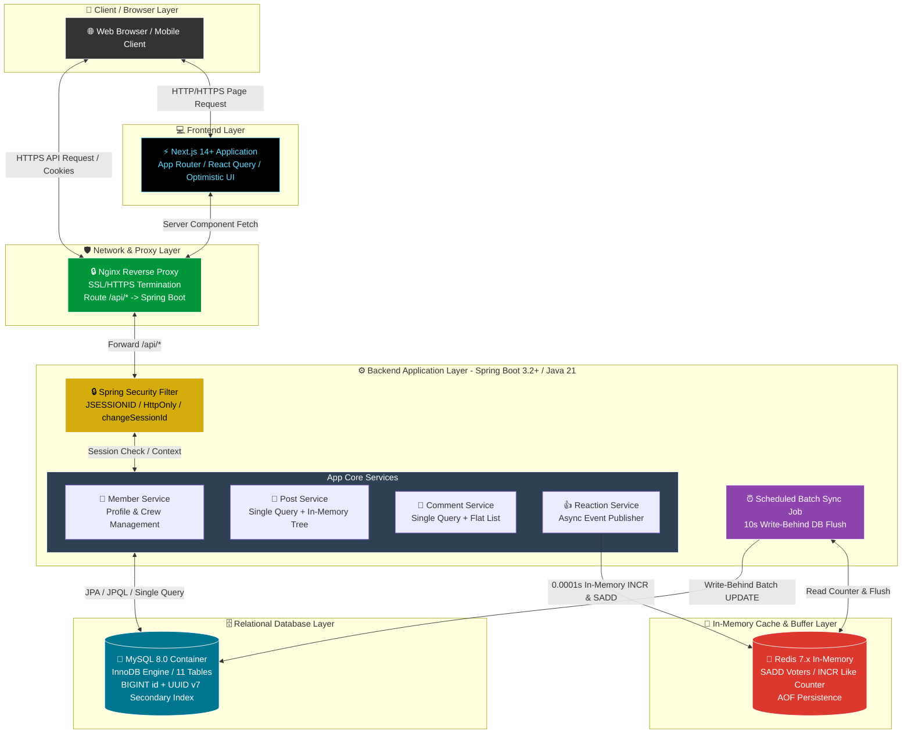

# [Notion] Snowthing 전체 시스템 아키텍처 구성도 (TIL)

> 📌 **작성 일자**: 2026년 8월 10일  
> 🏷️ **문서 목적**: 노션(Notion) 및 마크다운에 복사하여 전체 시스템 구성도, 계층별 역할, 데이터 흐름을 한눈에 파악하고 공부하기 위한 종합 가이드

---

## 📊 1. 시스템 구성도 다이어그램 (Mermaid System Architecture)

Below is the system architecture diagram rendered directly in GitHub Markdown and Notion.

---

## 🔍 2. 5대 계층 구조 및 핵심 기술 요약

1. **`Client & Frontend`**: Next.js 14+, React Query의 **낙관적 UI 업데이트**를 통해 추천 0.001초 미친 반응성 제공.
2. **`Proxy & Network`**: Nginx를 통해 `/api/*` 라우팅 분리 및 **6대 쿠키 보안 속성** 적용.
3. **`Backend Core`**: Spring Boot 3.x, **`Single Query + In-Memory Tree`**로 N+1 문제 완파, 10초 주기 **`Write-Behind` 배치 스케줄러** 구동.
4. **`In-Memory Cache`**: Redis 7.x `INCR`/`SADD`로 DB 락 병목 제거, AOF로 데이터 유실 방지.
5. **`Relational Database`**: MySQL 8.0 (11개 테이블), `BIGINT id` + **`UUID v7` 세컨더리 인덱스** 적용.
